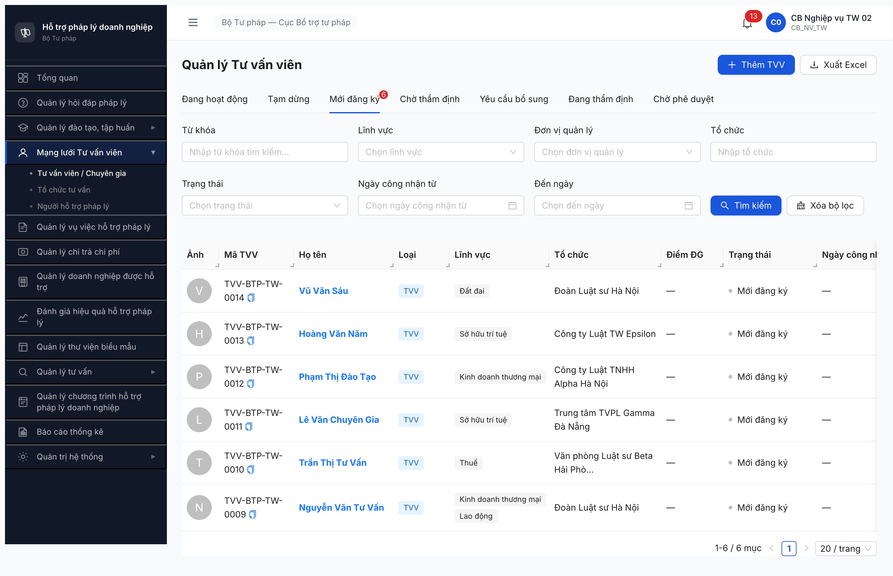

# Seed checklist — R7.2.5 Seed 6 TVV TW (loai_tvv=TVV, MOI_DANG_KY)

**Ngày chạy:** 2026-05-07 (R7)
**Account:** `cb_nv_tw_02` (CB_NV_TW) · OTP `666666` bypass
**Tool:** Chrome DevTools MCP — UI click chain qua form `/chuyen-gia-tvv/tao-moi`
**Fixture:** [seed-fixture.yaml v2.7.3 §tvv_variants[1-6]](../../../../input/data/seed-fixture.yaml) line 631-751
**SRS ref:** FR-IV-07 (TVV/CG profile, enum `loaiTvv ∈ {TVV, CG}` sau v2.6.0 R5 split) · `srs-update-2026-5-5/srs-fr-04-chuyen-gia-tvv.md` (FR-04 v3.5)
**Upstream gate:** R7.2.3 ✅ TC TV `HOAT_DONG` (5 record TC-BTP-TW-0001..0005)

## Kết quả tổng

✅ **6/6 PASS** — Tab "Mới đăng ký" hiện 6 record `loaiTvv=TVV` `trangThai=MOI_DANG_KY`.

## Pool sau seed

| Mã TVV | Họ tên | UUID | LV (UI list) | Trình độ | TC chính (FK) |
|---|---|---|---|---|---|
| TVV-BTP-TW-0009 | Nguyễn Văn Tư Vấn | `88e14d69-d1cf-453f-a265-61b72c9216d1` | KDTM, Lao động | Thạc sĩ | TC-BTP-TW-0004 (Đoàn LS HN) |
| TVV-BTP-TW-0010 | Trần Thị Tư Vấn | `e2277512-5ceb-4489-b4a9-efe6564d8d0d` | Thuế | Tiến sĩ | TC-BTP-TW-0002 (Beta HP) |
| TVV-BTP-TW-0011 | Lê Văn Chuyên Gia | `720eda6c-ad48-4f04-864e-dceba9a74ac2` | SHTT | Thạc sĩ | TC-BTP-TW-0003 (Gamma ĐN) |
| TVV-BTP-TW-0012 | Phạm Thị Đào Tạo | `e6522466-065a-4db6-9a86-32e3bea776b7` | KDTM | Tiến sĩ | TC-BTP-TW-0001 (Alpha HN) |
| TVV-BTP-TW-0013 | Hoàng Văn Năm | `1f98a6e0-537d-44ec-a75c-cc5a3ddcf5d4` | SHTT | Cử nhân | TC-BTP-TW-0005 (Epsilon TW) |
| TVV-BTP-TW-0014 | Vũ Văn Sáu | `e4aad026-d996-45b3-8ab0-fb766adb60a0` | Đất đai | Thạc sĩ | TC-BTP-TW-0004 (Đoàn LS HN) |

Bằng chứng:  · API response: [r7-2-5-tvv-list-mdk-response.network-response](r7-2-5-tvv-list-mdk-response.network-response)

## Per-filter verify

Acceptance per CLAUDE.md "Quy tắc seed task" — ≥1 record cho mỗi LV downstream filter.

| Lĩnh vực (UI) | Record cover | Đánh giá |
|---|---|---|
| Lao động | TVV-0009 | ✅ ≥1 |
| Thuế | TVV-0010 | ✅ ≥1 |
| Kinh doanh thương mại | TVV-0009, TVV-0012 | ✅ ≥2 |
| Sở hữu trí tuệ | TVV-0011, TVV-0013 | ✅ ≥2 |
| Đất đai | TVV-0014 | ✅ ≥1 |
| Doanh nghiệp | — | N/A (UI thiếu — BUG-DM-LVPL-001 known) |
| Thương mại (separate) | — | N/A (UI dùng "Kinh doanh thương mại") |

**Coverage 5/5 LV available trong UI ✅** — đạt acceptance.

## Quirk + lưu ý

1. **Form schema mới (v3.5)**: KHÔNG có field `dia_ban_ids` (đã bỏ per NĐ 77/2008 Đ.19) ✅. KHÔNG có `loai_tvv: NHT` (NHT entity riêng, FR-IV-NHT-01) ✅. Default "Loại" = `Tư vấn viên (TVV)`.
2. **UI dropdown LV chỉ có 10 LV** — thiếu DOANH_NGHIEP/THUONG_MAI/DAU_TU per SRS FR-VIII-01 (10 LV authoritative). Pre-seed BUG-DM-LVPL-001 vẫn Open. Workaround: substitute KDTM cho DOANH_NGHIEP/THUONG_MAI variants.
3. **TC TV mapping**: Fixture variants 1-6 reference TC name không match với 5 TC HOAT_DONG đã seed (R7.2.3). Adapt mapping dùng 5 TC sẵn có:
   - Đoàn LS HN ↔ variant 1+6
   - Beta HP ↔ variant 2
   - Gamma ĐN ↔ variant 3
   - Alpha HN ↔ variant 4
   - Epsilon TW ↔ variant 5
4. **⚠️ 4/6 record chỉ saved 1 LV thay vì 2** (variants 2/3/4/6) — procedural QA: click 2 LV trong cùng `evaluate_script` loop → AntD virtual list re-render giữa 2 click → chỉ LV cuối được persist. Variant 1 OK do click 2 LV ở 2 evaluate_script tách. Variant 5 spec chỉ 1 LV, OK.
   - **Non-blocking**: per-filter coverage vẫn ≥1/LV → R7.4.A1 workflow tiếp tục được.
   - **Recommendation**: nếu R7.7.2 functional cần test multi-LV per record, bổ sung LV thứ 2 qua "Sửa hồ sơ" sau (R7.4.A1 advance state vẫn proceed được).
5. **UI list cột "Lĩnh vực" cắt ngắn**: chỉ TVV-0009 hiện 2 LV; rest 1 LV. linhVucText API field cũng chỉ 1 LV cho variants 2-6 (xác nhận BE thật sự chỉ lưu 1 LV).

## Downstream gate (state output)

- ✅ ≥1 TVV `MOI_DANG_KY` cover 5 LV available — đáp ứng dependency cho:
  - R7.4.A1 ⏳ Workflow TVV (SM 9→10 state CHO_KICH_HOAT)
  - R7.4.A2 ⏳ Tiếp nhận TVV (FR-IV-13, transition `MOI_DANG_KY → CHO_THAM_DINH`)
  - R7.7.2 ⏳ Functional CG/TVV 31 TC

## Bug verify retest (kèm theo)

🔴 **BUG-CG-A1-001 VẪN OPEN** sau dev claim fix — verify TVV-BTP-TW-0007 (CG đã approve) state vẫn `DANG_HOAT_DONG` qua API GET (không phải `CHO_KICH_HOAT` per spec). UI tab list cũng chưa có "Chờ kích hoạt". Detail: [bug-report-flow-r7-4-a1-cg-state.md](../../bug-reports/tu-van-vien-cg/bug-report-flow-r7-4-a1-cg-state.md) blockquote "Re-test 2026-05-07".
