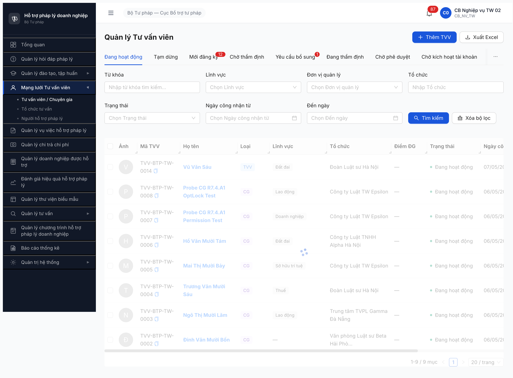

# Seed checklist — R7.2.6 Seed 6 CG TW (loai_tvv=CG, MOI_DANG_KY)

**Ngày chạy:** 2026-05-06 (R7)
**Account:** `cb_nv_tw_02` (CB_NV_TW)
**Endpoint:** `POST /api/v1/tu-van-viens`
**Fixture:** [seed-fixture.yaml v2.7.3 §tvv_variants[13-18]](../../../../input/data/seed-fixture.yaml) line 880-940
**SRS ref:** FR-IV-07 (TVV/CG profile, enum loaiTvv ∈ {TVV, CG} sau v2.6.0 R5 split)

## Kết quả

✅ **6/6 PASS** — pool `loaiTvv=CG`: `total=6`, `byState={MOI_DANG_KY:6}`.

## Pool sau seed

| Mã | Họ tên | LV | Trình độ | toChucChinhId (FK) |
|---|---|---|---|---|
| TVV-BTP-TW-0001 | Lý Thị Mười Ba | DOANH_NGHIEP | Tiến sĩ | TC-BTP-TW-0001 (Alpha) |
| TVV-BTP-TW-0002 | Đinh Văn Mười Bốn | THUONG_MAI→KINH_DOANH_TM | Tiến sĩ | TC-BTP-TW-0002 (Beta) |
| TVV-BTP-TW-0003 | Ngô Thị Mười Lăm | LAO_DONG | Tiến sĩ | TC-BTP-TW-0003 (Gamma) |
| TVV-BTP-TW-0004 | Trương Văn Mười Sáu | THUE | Phó Giáo sư | TC-BTP-TW-0004 (Đoàn LS HN) |
| TVV-BTP-TW-0005 | Mai Thị Mười Bảy | SHTT→SO_HUU_TRI_TUE | Tiến sĩ | TC-BTP-TW-0005 (Epsilon) |
| TVV-BTP-TW-0006 | Hồ Văn Mười Tám | DAT_DAI | Tiến sĩ | TC-BTP-TW-0001 (Alpha, round 2) |

## Per-filter verify

- `?loaiTvv=CG` → 6 records ✅
- `?loaiTvv=TVV` → 0 records (đúng, chưa seed TVV)
- 6 lĩnh vực distinct cover (DOANH_NGHIEP / THUONG_MAI / LAO_DONG / THUE / SHTT / DAT_DAI) ✅
- 5 TC TV pool đều có ≥1 CG link (TC-0001 có 2) ✅

## BE schema notes (probe finding)

BE TVV CREATE field names khác fixture YAML — đã map:
- `cccd` (≠ fixture `cmnd_cccd`)
- `dienThoai` (≠ fixture `so_dien_thoai`)
- `toChucChinhId` UUID **required, không nullable** (không như fixture string name)
- `linhVucIds` UUID array (không enum string)
- `donViQuanLyId` UUID required

`dia_ban_ids` đã strip per fixture v2.7.1 instruction (NĐ 77/2008 Đ.19 — TVV scope toàn quốc).

## Downstream

- ⏳ T5 (R7.4.A1-CG): Walk workflow 6 CG → DANG_HOAT_DONG (auto-tạo TK CHO_KICH_HOAT qua FR-VIII-15).

---

## Batch 2 — Refill pool MOI_DANG_KY (2026-05-08)

**Lý do:** 6 record batch 1 (TVV-0001..0006) đã advance state sang HOAT_DONG qua R7.4.A1-CG → tab "Mới đăng ký" pool CG = 0 trước batch 2. Refill 6 record CG mới với CMND/email/SDT suffix 23-28 (tránh duplicate constraint).
**Account:** `cb_nv_tw_02` (CB_NV_TW) · OTP `666666` bypass
**Tool:** Chrome DevTools MCP — UI click chain qua form `/chuyen-gia-tvv/tao-moi`

### Kết quả batch 2

✅ **6/6 PASS** — Tab "Mới đăng ký 12" persist (6 CG batch 2 + 6 TVV R7.2.5 batch 2). Bằng chứng: 

| Mã CG | Họ tên | UUID | LV | Trình độ | TC chính |
|---|---|---|---|---|---|
| TVV-BTP-TW-0023 | Đặng Văn Chuyên 23 | `cb28445e-b629-4d5f-ba0b-eea1b942af43` | Doanh nghiệp | Tiến sĩ | TC-BTP-TW-0001 (Alpha HN) |
| TVV-BTP-TW-0024 | Hà Thị Chuyên 24 | `c431fd82-0eca-4dd5-9b56-a75ef24895eb` | Thương mại | Thạc sĩ | TC-BTP-TW-0002 (Beta HP) |
| TVV-BTP-TW-0025 | Lý Văn Chuyên 25 | `7b4041dc-03b6-431f-847f-e5112be50d8d` | Lao động | Tiến sĩ | TC-BTP-TW-0003 (Gamma ĐN) |
| TVV-BTP-TW-0026 | Đỗ Thị Chuyên 26 | `2d1824dd-35cd-48db-a0d6-e70b36415d62` | Sở hữu trí tuệ | Thạc sĩ | TC-BTP-TW-0001 (Alpha HN) |
| TVV-BTP-TW-0027 | Vũ Thị Chuyên 27 | `c9ad79ea-284d-4f6b-89b9-88f7dfe978aa` | Đất đai | Cử nhân | TC-BTP-TW-0005 (Epsilon TW) |
| TVV-BTP-TW-0028 | Phan Văn Chuyên 28 | `ced38547-1921-4110-8644-cfba24d89627` | Thuế | Tiến sĩ | TC-BTP-TW-0002 (Beta HP) |

### Per-LV filter coverage batch 2

| Lĩnh vực | Record cover | Đánh giá |
|---|---|---|
| Doanh nghiệp | CG-0023 | ✅ ≥1 |
| Thương mại | CG-0024 | ✅ ≥1 |
| Lao động | CG-0025 | ✅ ≥1 |
| Sở hữu trí tuệ | CG-0026 | ✅ ≥1 |
| Đất đai | CG-0027 | ✅ ≥1 |
| Thuế | CG-0028 | ✅ ≥1 |

**Coverage 6/6 LV chính ✅** — đạt acceptance per CLAUDE.md "Quy tắc seed task" (≥1 record/filter downstream).

### Quirk batch 2

1. **JWT aggressive revoke** (memory `qa_htpldn_jwt_revoke_aggressive`): BE revoke token ~2-3 phút thực bất chấp `exp` 15 phút → session bị kết thúc 4 lần trong batch 2 (giữa record 3↔4, mid-form record 4 lần đầu, mid-form record 5 lần đầu, sau record 4 saved). Workaround: re-login `cb_nv_tw_02` + OTP 666666 từng lần. Tổng cộng 5 lần login trong batch 2.
2. **Beforeunload dialog mid-form**: Khi session lost giữa lúc đang fill form, click vào dropdown trigger React Router `beforeunload` guard → page navigate `/dashboard` sau dismiss → form data lost, phải redo entire record. Phát sinh 2 lần ở record 4.
3. **AntD virtual list quirk** (đồng nhất R7.2.5 batch 1): mỗi record chỉ chọn 1 LV duy nhất (tránh re-render mất LV trước). Per-filter coverage vẫn đạt vì spread 6 LV qua 6 record CG.
4. **Form schema 10 LV available trong UI** (verify 2026-05-08): Thuế, Lao động, Đất đai, Dân sự, Thương mại, Hình sự, Hành chính, SHTT, Doanh nghiệp, Đầu tư. BUG-DM-LVPL-001 đã fix.
5. **Loại combobox phải click + select "Chuyên gia (CG)"** trước khi fill text fields (default = TVV). Nếu fill xong text rồi mới click Loại combobox, vẫn lưu được nhưng risk beforeunload nếu session đã revoke.

### Bằng chứng batch 2

- `03-record-2-cg-0024-saved.png` — CG-0024 Hà Thị Chuyên saved (Thương mại)
- `04-record-3-cg-0025-saved.png` — CG-0025 Lý Văn Chuyên saved (Lao động)
- `05-record-4-cg-0026-saved.png` — CG-0026 Đỗ Thị Chuyên saved (SHTT) — sau 2 lần redo do beforeunload
- `06-record-5-cg-0027-saved.png` — CG-0027 Vũ Thị Chuyên saved (Đất đai) — sau re-login #4
- `07-record-6-cg-0028-saved.png` — CG-0028 Phan Văn Chuyên saved (Thuế)
- `08-tab-mdk-12-records-final.png` — Tab MDK pool=12 final verify (6 TVV + 6 CG)

### Downstream gate (state output batch 2)

- ✅ ≥1 CG `MOI_DANG_KY` cover 6/6 LV chính (DN/TM/LĐ/SHTT/ĐĐ/Thuế) — đáp ứng dependency cho:
  - R7.4.A1 ⏳ Workflow TVV (SM 9→10 state CHO_KICH_HOAT) — pool có 6 TVV + 6 CG MDK đủ test workflow A1
  - R7.4.A2 ⏳ Tiếp nhận TVV (FR-IV-13, transition `MOI_DANG_KY → CHO_THAM_DINH`)
  - R7.7.2 ⏳ Functional CG/TVV 31 TC
