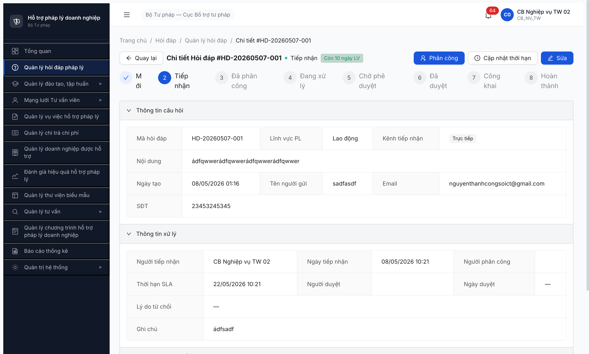
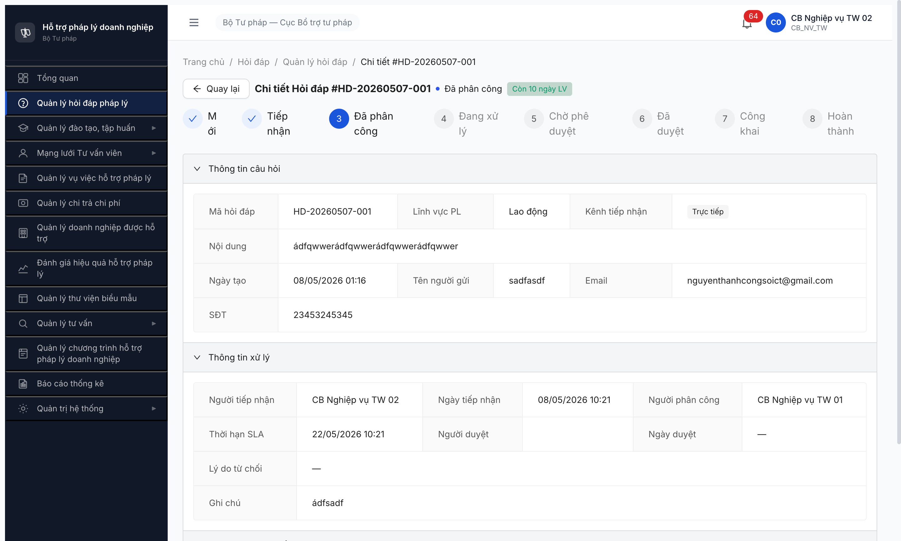
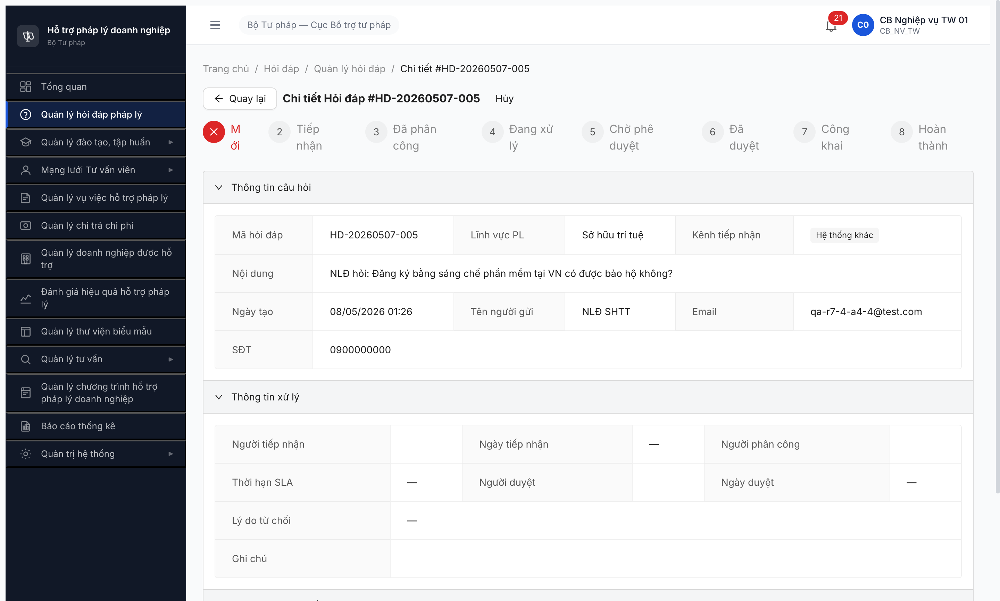
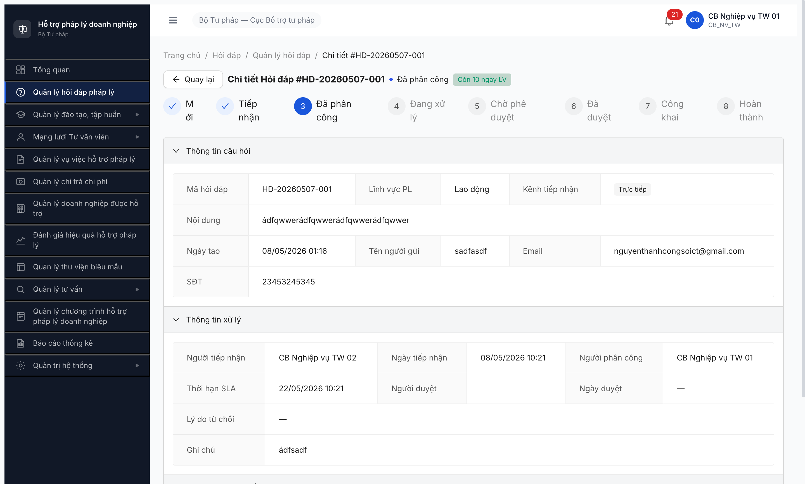

# Workflow Test Report — Hỏi đáp pháp lý (FR-02 SM-HOIDAP v3.5)

> **Module:** Hỏi đáp pháp lý (`HOI_DAP`) · **SRS:** [`srs-update-2026-5-5/srs-fr-02-hoi-dap.md`](../../../../../input/srs-update-2026-5-5/srs-fr-02-hoi-dap.md) line 40-47 · **Round:** R7 · **Date:** 2026-05-08 · **Tester:** QA Automation
> **Bug:** [bug-report-flow-hoi-dap.md](../../bug-reports/hoi-dap/bug-report-flow-hoi-dap.md) — 2 Open (BUG-HD-001 Critical, BUG-HD-002 Major)
> **Accounts:** `cb_nv_tw_02` (CB tiếp nhận T1) · `cb_nv_tw_01` (CB được phân công, walk T10)

---

## Kết luận

⚠️ **PARTIAL 3/11 transition** — T1 (MOI→TIEP_NHAN), T2 (TIEP_NHAN→DA_PHAN_CONG), T10 (MOI→HUY) PASS qua UI. **T3-T9 BLOCKED** do FE thiếu entry FR-II-04 Phản hồi: detail page state DA_PHAN_CONG không có button [Phản hồi]/[Bắt đầu xử lý] + tab "Đang xử lý" filter sai (rỗng dù có 3 record DA_PHAN_CONG).

---

## Bảng kiểm tra workflow

| # | Transition | Actor | Sample | Status | Bug / Note |
|:-:|---|---|---|:-:|---|
| T1 | `MOI → TIEP_NHAN` (CB tiếp nhận, button [check Tiếp nhận] + confirm modal) | `cb_nv_tw_02` | HD-20260507-001 | ✅ | Modal "Xác nhận tiếp nhận" → click [Tiếp nhận] → state "Tiếp nhận", Người tiếp nhận = cb_nv_tw_02, SLA "22/05/2026 10:21" auto +10 ngày LV |
| T2 | `TIEP_NHAN → DA_PHAN_CONG` (CB phân công, button [user-switch Phân công] + modal "Phân công xử lý") | `cb_nv_tw_02` | HD-20260507-001 | ✅ | Modal có "Gợi ý phân công" 1 record cb_nv_tw_01 (workload 0). Radio + click [Phân công] → state "Đã phân công", Người phân công = cb_nv_tw_01 |
| T3 | `DA_PHAN_CONG → DANG_XU_LY` (Người được phân công bắt đầu xử lý, expected button [Phản hồi]/[Bắt đầu xử lý]) | `cb_nv_tw_01` | HD-20260507-001 | 🚫 | **BLOCK FE bug.** Detail state DA_PHAN_CONG không có button action + tab "Đang xử lý" rỗng. Log [BUG-HD-001](../../bug-reports/hoi-dap/bug-report-flow-hoi-dap.md) Critical |
| T4 | `DANG_XU_LY → DA_TRA_LOI/CHO_PHE_DUYET` (CB tích "Đã trả lời" → BR-FLOW-01 auto) | `cb_nv_tw_01` | — | 🚫 | BLOCK do T3 không tới được DANG_XU_LY |
| T5 | `CHO_PHE_DUYET → DA_DUYET` (CB Phê duyệt approve) | `cb_pd_tw_02` | — | 🚫 | BLOCK upstream T4 |
| T6 | `DA_DUYET → CONG_KHAI` (Modal "Công khai" 5 trường CR-01) | `cb_pd_tw_02` | — | 🚫 | BLOCK upstream T5. Indicator B0#8 chưa verify |
| T7 | `CONG_KHAI → DA_DUYET` (Hủy công khai) | `cb_pd_tw_02` | — | 🚫 | BLOCK upstream T6 |
| T8 | `DA_DUYET / CONG_KHAI → HOAN_THANH` (Đóng hồ sơ thủ công, BR-FLOW-06) | `cb_pd_tw_02` | — | 🚫 | BLOCK upstream T6. Indicator B0#7 chưa verify |
| T9 | `CHO_PHE_DUYET → DANG_XU_LY` (Phê duyệt từ chối, trả lại) | `cb_pd_tw_02` | — | 🚫 | BLOCK upstream T4 |
| T10 | `MOI → HUY` (Hủy hồ sơ ở MOI, button [Hủy hồ sơ] + confirm modal) | `cb_nv_tw_01` | HD-20260507-005 | ✅ | Modal "Xác nhận hủy?" → click [Hủy hồ sơ] → state "Hủy". **Note:** modal KHÔNG yêu cầu lý do hủy (cần verify SRS — possible field thiếu) |
| T11 | Variants kênh entry (TVN_BRIDGE, MoB) | system | — | ⏭ | Pool toàn record kênh "Trực tiếp"/"Hệ thống khác". TVN_BRIDGE chỉ qua FR-X.2-04 escalate, ngoài scope walk này |

> Icon: ✅ pass · ❌ fail · ⏭ skip · 🚫 blocked · — chưa test

---

## Lịch sử round

| Round | Date | Kết quả tóm tắt (1 dòng) |
|---|---|---|
| R7 | 2026-05-08 | PARTIAL 3/11. T1+T2 happy-path tới DA_PHAN_CONG. T10 Hủy. T3-T9 BLOCK FE Phản hồi entry missing (BUG-HD-001 Critical) |

---

## End-state pool (sau R7 B4)

7 records pool HD:
| Mã | LV | Kênh | Trạng thái cuối | Người tiếp nhận | Người phân công |
|---|---|---|---|---|---|
| HD-20260507-001 | Lao động | Trực tiếp | **DA_PHAN_CONG** ← R7 B4 T1+T2 | cb_nv_tw_02 | cb_nv_tw_01 |
| HD-20260507-002 | Lao động | Trực tiếp | DA_PHAN_CONG | (pre-seed) | cb_nv_tw_01 |
| HD-20260507-003 | Đất đai | Hệ thống khác | MOI | — | — |
| HD-20260507-004 | Thuế | Trực tiếp | HUY (pre-seed) | — | — |
| HD-20260507-005 | SHTT | Hệ thống khác | **HUY** ← R7 B4 T10 | — | — |
| HD-20260507-006 | Doanh nghiệp | Trực tiếp | DA_PHAN_CONG | cb_nv_tw_01 | cb_nv_tw_01 |
| HD-20260507-007 | Lao động | Hệ thống khác | MOI | — | — |

---

## Bằng chứng (R7)

**T1 — `MOI → TIEP_NHAN` HD-001:**

**T2 — `TIEP_NHAN → DA_PHAN_CONG` HD-001:**

**T10 — `MOI → HUY` HD-005:**

**T3 BUG — Detail DA_PHAN_CONG thiếu button action:**

**T3 BUG — Tab "Đang xử lý" rỗng dù có 3 record DA_PHAN_CONG:**

---

## Note môi trường

- **JWT revoke aggressive:** lặp 4 lần trong session. Workaround: `navigate_page` direct URL detail sau mỗi login.
- **Multi-role test:** App auth dùng HttpOnly cookie sticky. Dùng `mcp__chrome-devtools__new_page` với `isolatedContext` để switch role không kick session cũ.
- **B0 indicator 7+8 chưa verify:** Đóng HS thủ công (BR-FLOW-06) + Modal Công khai 5 trường CR-01 — phải có HD ở DA_DUYET để verify, đang block do T3.

---

*R7 | QA Automation via Claude Code (Chrome DevTools MCP)*
