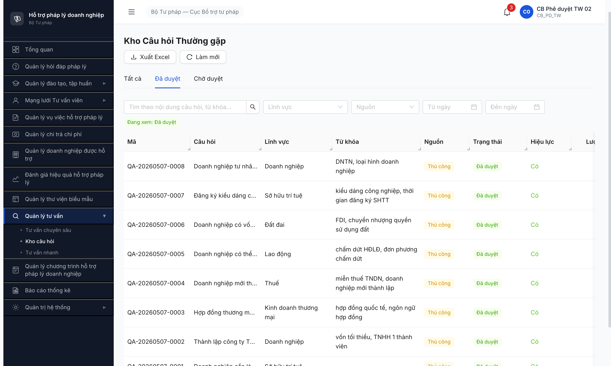
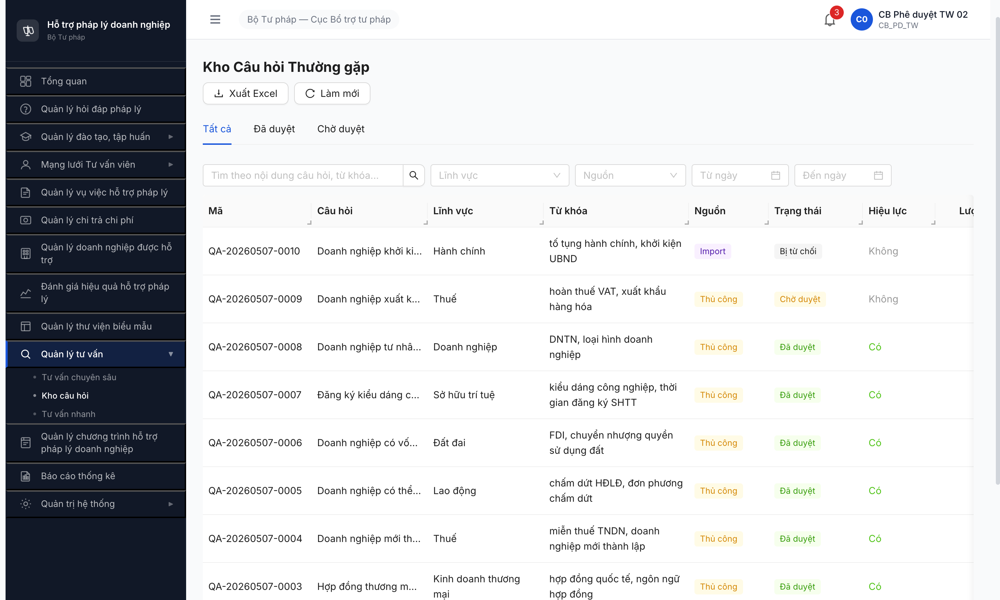
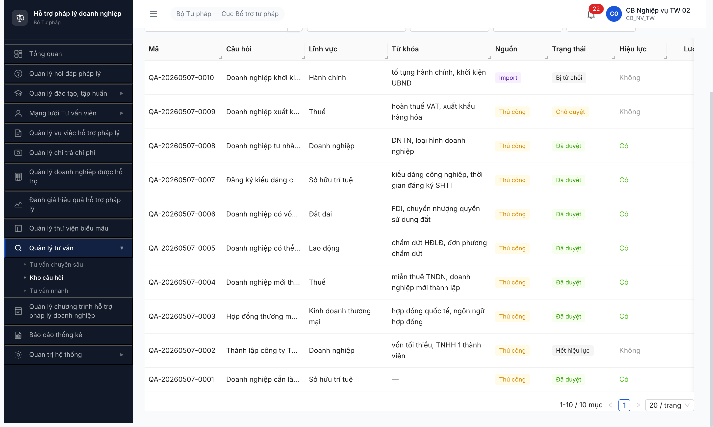
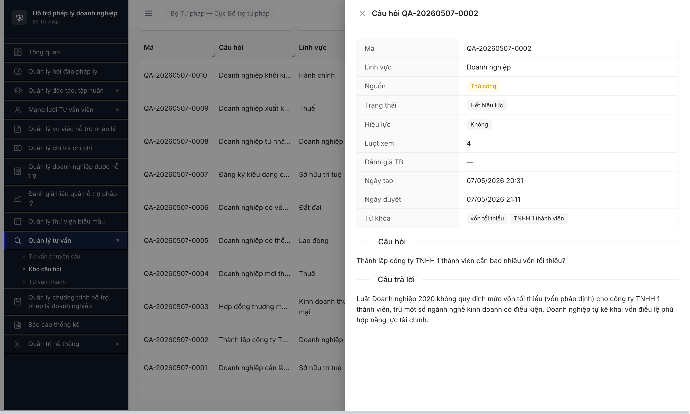

# Workflow Test Report — Kho câu hỏi tư vấn nhanh (FR-X.2-01 SM-KHOCAUHOI)

> **Module:** Kho câu hỏi (`KHO_CAU_HOI`) · **SRS:** [`02-thu-tu-module.md line 777-789 §SM-KHOCAUHOI`](../../../../../input/quy-trinh-nghiep-vu/02-thu-tu-module.md) + [`srs-fr-13-tv-nhanh.md §FR-X.2-01 UC158 SCR-X2-01`](../../../../../input/srs-v3/srs-fr-13-tv-nhanh.md) · **Round:** R7 · **Date:** 2026-05-07 · **Tester:** QA Automation
> **Bug:** [bug-report-flow-kho-qa.md](../../bug-reports/kho-qa/bug-report-flow-kho-qa.md) — 1 Open (BUG-KHOQA-002 Major), 1 Closed (BUG-KHOQA-001 Critical)
> **Accounts:** `cb_nv_tw_02` (creator/biên soạn) · `cb_pd_tw_02` (phê duyệt)

---

## Kết luận

⚠️ **PARTIAL PASS** — **7/8 transition PASS, 1/8 BLOCK do FE bug**. Cover 7 transition của SM-KHOCAUHOI: T1 (Submit THU_CONG), T2 (Import IMPORT), T4 (Duyệt đơn lẻ), T5 (Duyệt hàng loạt), T6 (Từ chối), T7 (Toggle off DA_DUYET → HET_HIEU_LUC). T8 (Toggle on HET_HIEU_LUC → DA_DUYET) **KHÔNG test được qua UI** vì detail modal câu hỏi state HET_HIEU_LUC thiếu button "Kích hoạt" — log BUG-KHOQA-002 (Major).

> **Note:** Transition T0 (auto-feed `FR-02 DA_DUYET → KHO_CAU_HOI DA_DUYET nguồn=TU_DONG`) thuộc R7.6.2 cross-module test, không thuộc scope D3.

---

## Bảng kiểm tra workflow

| # | Transition | Actor | Sample | Status | Bug / Note |
|:-:|---|---|---|:-:|---|
| T1 | `— → CHO_DUYET` (Submit THU_CONG, SCR-X2-01 Modal Thêm câu hỏi, button [Lưu]) | `cb_nv_tw_02` | 8 record QA-0002..0008 cover 6 LV (DN, KDTM, Thuế, LĐ, ĐĐ, SHTT) | ✅ | R7.3.16 đã PASS — 8/8 record `THU_CONG` state `CHO_DUYET` |
| T2 | `— → CHO_DUYET` (Import IMPORT, SCR-X2-01 Modal Nhập Excel) | `cb_nv_tw_02` | 1 record QA-0010 LV Hành chính từ file kho-qa-import.xlsx | ✅ | R7.3.16 đã PASS — record `nguon=Import` |
| T4 | `CHO_DUYET → DA_DUYET` (Duyệt đơn lẻ, button [check Duyệt] trong detail modal) | `cb_pd_tw_02` | QA-0002 (LV Doanh nghiệp) | ✅ | Transition trên SCR-X2-01 detail modal. Toast "Duyệt thành công" |
| T5 | `CHO_DUYET → DA_DUYET` (Duyệt hàng loạt, checkbox + button [check Duyệt hàng loạt] + confirm modal) | `cb_pd_tw_02` | 6 record (QA-0003..0008) cover 6 LV | ✅ | Confirm modal "Duyệt 6 câu hỏi?" → click [Duyệt hàng loạt]. Tab "Đã duyệt" còn 8 record |
| T6 | `CHO_DUYET → NHAP` (Từ chối với lý do bắt buộc, button [close Từ chối] + textarea required) | `cb_pd_tw_02` | QA-0010 (LV Hành chính, nguồn Import) | ✅ | Lý do 187 chars qua React-aware setter (AntD textarea cleared sau dropdown interaction). Trạng thái "Bị từ chối" hiển thị UI (= state `NHAP` per SRS) |
| T7 | `DA_DUYET → HET_HIEU_LUC` (Toggle hiệu lực off, button [stop Hết hiệu lực] + confirm modal "Đánh dấu hết hiệu lực?") | `cb_nv_tw_02` | QA-0002 (LV Doanh nghiệp) | ✅ | Sau click [Đồng ý] toast "Đã đánh dấu hết hiệu lực". Trạng thái `Hết hiệu lực`, Hiệu lực `Không` |
| T8 | `HET_HIEU_LUC → DA_DUYET` (Toggle hiệu lực on, expected button "Kích hoạt") | `cb_nv_tw_02` | QA-0002 (đã HET_HIEU_LUC) | 🚫 | **BLOCK FE bug.** Detail modal câu hỏi state `HET_HIEU_LUC` chỉ có button [Đóng], thiếu button "Kích hoạt"/"Khôi phục". Log [BUG-KHOQA-002](../../bug-reports/kho-qa/bug-report-flow-kho-qa.md) Major |

> Icon: ✅ pass · ❌ fail · ⏭ skip · 🚫 blocked · — chưa test

---

## Lịch sử round

| Round | Date | Kết quả tóm tắt (1 dòng) |
|---|---|---|
| R7 | 2026-05-07 | PARTIAL 7/8 transition. T1/T2/T4/T5/T6/T7 ✅. T8 🚫 blocked do BUG-KHOQA-002 (FE thiếu button Kích hoạt). |

---

## End-state pool (sau R7)

| Mã | LV | Nguồn | Trạng thái cuối | Hiệu lực |
|---|---|---|---|---|
| QA-20260507-0001 | Sở hữu trí tuệ | Thủ công | DA_DUYET | Có |
| QA-20260507-0002 | Doanh nghiệp | Thủ công | **HET_HIEU_LUC** | Không |
| QA-20260507-0003 | Kinh doanh thương mại | Thủ công | DA_DUYET | Có |
| QA-20260507-0004 | Thuế | Thủ công | DA_DUYET | Có |
| QA-20260507-0005 | Lao động | Thủ công | DA_DUYET | Có |
| QA-20260507-0006 | Đất đai | Thủ công | DA_DUYET | Có |
| QA-20260507-0007 | Sở hữu trí tuệ | Thủ công | DA_DUYET | Có |
| QA-20260507-0008 | Doanh nghiệp | Thủ công | DA_DUYET | Có |
| QA-20260507-0009 | Thuế | Thủ công | CHO_DUYET (backup) | Không |
| QA-20260507-0010 | Hành chính | Import | NHAP (Bị từ chối) | Không |

7 record `DA_DUYET hieu_luc=Có` cover 5/6 LV chính (DN, KDTM, Thuế, LĐ, ĐĐ, SHTT) sẵn sàng cho R7.6.2 (TV nhanh PUBLIC dropdown đọc Kho QA hiệu lực).

---

## Bằng chứng (R7)

**T5 — `CHO_DUYET → DA_DUYET` bulk** *(8 record DA_DUYET cover 6 LV trên tab Đã duyệt)*:

**T6 — `CHO_DUYET → NHAP` reject** *(QA-0010 trạng thái "Bị từ chối")*:

**T7 — `DA_DUYET → HET_HIEU_LUC` toggle off** *(QA-0002 trạng thái "Hết hiệu lực" + toast)*:

**T8 BUG — Detail modal HET_HIEU_LUC thiếu button Kích hoạt** *(chỉ có icon X Đóng)*:

---

*R7 | QA Automation via Claude Code (Chrome DevTools MCP)*
