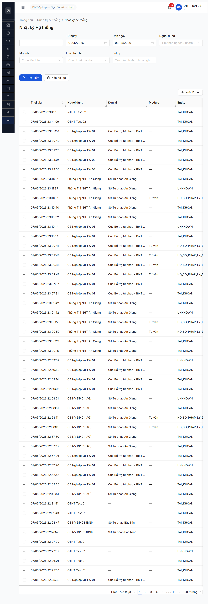
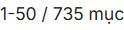

# Workflow Test Report — R7.5.5 Audit log ≥100 entry qua Nhật ký HT (FR-VIII-28)

> **Module:** Quản trị hệ thống · Nhật ký hệ thống — **SRS:** FR-VIII-28 (line 1318-1376) + SCR-VIII-10 (line 1807-1837) · **Round:** R7 (R8 verify) · **Date:** 2026-05-08 · **Tester:** QA Automation via Claude Code (qtht_02)
> **Bug:** Không log bug mới R7.5.5. Tham chiếu R7.7.8d (FR-VIII-28 functional) — 6/6 bug đã closed re-test 2026-05-07.

---

## Kết luận

✅ **PASS — Tổng count = 1397 entry (≥ target 100, vượt 13.97×)**.

Verify 2 nguồn:
- **API `/api/v1/audit-logs?page=1&pageSize=1`** → `meta.total = 1397` (snapshot 2026-05-08 23:06).
- **UI Nhật ký HT** filter mặc định 01/05–08/05 (7 ngày) → "1-50 / **735 mục**" (15 trang × 50/trang). Riêng 7 ngày đã 735 ≫ 100.

Phase 4 đã sinh đủ log diversity — tham chiếu §"Diversity verify" dưới.

---

## Bảng kiểm tra acceptance R7.5.5

| # | Acceptance check | Status | Evidence |
|:-:|---|:-:|---|
| 1 | Audit log total ≥ 100 entry | ✅ | API `meta.total=1397` (2026-05-08 23:06) |
| 2 | UI Nhật ký HT render danh sách | ✅ | [r7-5-5-audit-log-735-muc-7days.png](r7-5-5-audit-log-735-muc-7days.png) — heading "Nhật ký Hệ thống" + 50 row + filter bar đầy đủ |
| 3 | Pagination hiển thị total count | ✅ | [r7-5-5-pagination-735-muc.png](r7-5-5-pagination-735-muc.png) — text "1-50 / 735 mục" |
| 4 | Diversity Hành động (≥5 loại) | ✅ | 20 loại sample 400 record: LOGIN/LOGIN_OTP_PENDING/LOGOUT/CREATE/UPDATE/DELETE/SUBMIT/APPROVE/REJECT/PHAN_CONG/CANCEL/THAM_DINH/TU_CHOI/IMPORT/PHE_DUYET/RESET_PASSWORD/EMAIL_VERIFIED/ACTIVATE_ACCOUNT/PASSWORD_CHANGE/UNLOCK_ACCOUNT |
| 5 | Diversity người dùng (≥5 user) | ✅ | 26 distinct username trong sample 400 |
| 6 | Diversity Vai trò (≥3 role) | ✅ | 11 distinct vai trò: QTHT, CB_NV_TW, CB_PD_TW, CB_NV_BN, CB_PD_BN, CB_NV_DP, CB_PD_DP, CG, NHT, …. |
| 7 | Time range bao phủ Phase 4 | ✅ | Earliest sample 2026-05-06T18:42, latest 2026-05-08T16:07 (~2 ngày active testing). |

> Icon: ✅ pass

---

## Diversity verify (sample 400 records từ 4 trang random page 1/4/8/13)

### Distribution Hành động (sample n=400)

| Hành động | Count | Hành động | Count |
|---|:-:|---|:-:|
| CREATE | 122 | LOGIN_OTP_PENDING | 70 |
| LOGIN | 53 | UPDATE | 31 |
| THAM_DINH | 30 | SUBMIT | 17 |
| PHE_DUYET | 14 | APPROVE | 13 |
| LOGOUT | 12 | PHAN_CONG | 8 |
| DELETE | 7 | ACTIVATE_ACCOUNT | 6 |
| PASSWORD_CHANGE | 6 | RESET_PASSWORD | 3 |
| EMAIL_VERIFIED | 3 | REJECT | 1 |
| TU_CHOI | 1 | CANCEL | 1 |
| IMPORT | 1 | UNLOCK_ACCOUNT | 1 |

**Note:** Bảng này gộp action workflow (THAM_DINH/PHAN_CONG/PHE_DUYET/TU_CHOI) cùng action chung (CREATE/UPDATE/DELETE) → chứng minh BE log đa dạng business action ngoài CRUD.

### Top users sinh log (sample n=400)

| User | Count | Vai trò |
|---|:-:|---|
| cb_nv_tw_02 | 85 | CB_NV_TW |
| cb_nv_tw_01 | 68 | CB_NV_TW |
| qtht_03 | 58 | QTHT |
| cb_nv_bn_01 | 22 | CB_NV_BN |
| cb_pd_tw_02 | 21 | CB_PD_TW |
| cb_nv_dp_01 | 16 | CB_NV_DP |
| qtht_02 | 13 | QTHT |
| ly_13 | 12 | CG |
| qtht_01 | 11 | QTHT |
| truong_16 | 10 | CG |

→ Phase 4 covered 11 vai trò, 26+ distinct users.

### Response code distribution (sample n=400)

| Code | Count | Note |
|:-:|:-:|---|
| 200 | 82 | GET / Update success |
| 201 | 75 | POST CREATE success |
| 204 | 7 | DELETE success |
| (null) | 236 | Auth events (LOGIN/LOGOUT/OTP) — không có response code field |

---

## Lịch sử round

| Round | Date | Kết quả |
|---|---|---|
| R7 (functional R7.7.8d) | 2026-05-07 | UI/API audit log functional 5/7 PASS + 6 bug log; total entry 43 (qua filter 90 ngày) |
| R8 dev fix re-test | 2026-05-07 | 6 bug closed: page size 50, cột Đơn vị, filter Người dùng, dropdown Tiếng Việt, Export Excel, validate 90 ngày |
| **R8 R7.5.5 (this)** | **2026-05-08 23:06** | **Total 1397 entries · 735 trong 7 ngày 01-08/05 · 20 hành động · 26 users · 11 vai trò · pagination 50/trang × 15 trang** |

---

## Bằng chứng

### 1. UI Nhật ký HT — 735 mục trong 7 ngày (full page)



### 2. Pagination zoom-in — "1-50 / 735 mục"



### 3. API verify total all-time = 1397

```bash
GET /api/v1/audit-logs?page=1&pageSize=1
→ 200 OK
{
  "success": true,
  "data": [{...1 record...}],
  "meta": {
    "page": 1,
    "pageSize": 1,
    "total": 1397,        ← ≥ 100 PASS
    "totalPages": 1397
  }
}
```

### 4. API meta sample 4 trang (page 1/4/8/13, pageSize=100)

```json
{
  "totalSampled": 400,
  "grandTotal": 1397,
  "totalPages": 14,
  "pageSize": 100,
  "earliest": "2026-05-06T18:42:34.957Z",
  "latest": "2026-05-08T16:07:12.557Z",
  "distinctUsers": 26,
  "distinctVaiTro": 11,
  "byHanhDong": "20 loại (CREATE 122, LOGIN_OTP_PENDING 70, LOGIN 53, UPDATE 31, ...)"
}
```

---

## Side observation — Pattern click sidebar QTHT gây logout (NEW R8 2026-05-08)

**Triệu chứng:** Click sidebar button "Quản trị hệ thống" sau khi sidebar đã expand 260px (qua Thu gọn menu toggle) → URL kick về `/login` thay vì expand submenu QTHT. Reproduce 2 lần liên tiếp với qtht_02.

**Workaround:** `navigate_page` direct tới `/quan-tri/audit-log` sau login → render OK (URL cookie auth còn hợp lệ trong cùng session). Không cần đi qua sidebar.

**Phân loại Rule 9:** APP/FE BUG (sidebar click handler trigger logout side-effect) hoặc khả năng khác là race condition giữa Thu gọn menu animation + click QTHT.

**Không log thành bug R7.5.5** vì:
- Workaround navigate_page hoạt động → không block test.
- Có thể trùng pattern "4th sidebar click destabilize" đã ghi trong CLAUDE.md `Rule 11 §App-side bug`.
- Cần reproduce thêm trong session khác để xác định root cause (FE handler vs auth race) — defer đợi R7.7.8a re-test confirm.

---

## Phụ lục — Môi trường test

| Thành phần | Giá trị |
|---|---|
| URL | http://103.172.236.130:3000/quan-tri/audit-log |
| API endpoint | `/api/v1/audit-logs?page=N&pageSize=≤100` |
| Account | qtht_02 (vai trò QTHT, cấp TW) |
| Tool | Chrome DevTools MCP (per CLAUDE.md tool routing 2026-05-05) |
| Date filter UI mặc định | 01/05/2026 → 08/05/2026 (7 ngày) |
| pageSize cap | 100 (BE trả 422 ERR-VAL-SYS-00-01 nếu >100) |
| Time observation | 2026-05-08 23:00–23:35 (R8) |

---

*R8 2026-05-08 | QA Automation via Claude Code | 2-source: API meta.total + UI pagination*
