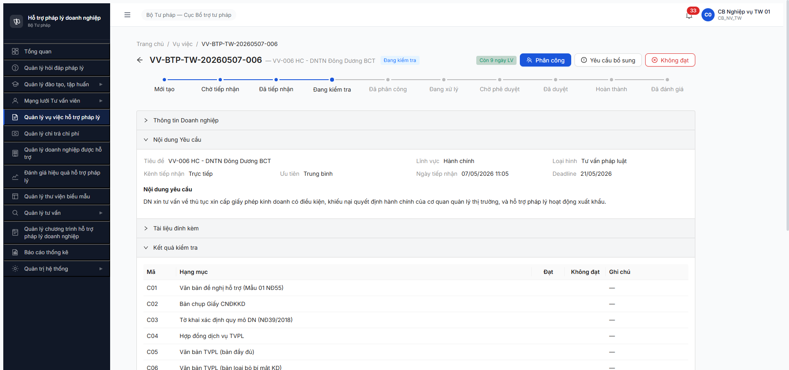

# Workflow Test Report — R7.4.A3-DN-BS DN bổ sung HS qua chuyên trang VNeID (FR-V.I-NEW-02)

> **Module:** Vụ việc HTPL — DN bổ sung hồ sơ · **FR:** [FR-V.I-NEW-02](../../../../input/srs-update-2026-5-5/srs-fr-05-vu-viec.md#L1288) · **Round:** R7.4.A3-DN-BS · **Date:** 2026-05-08 · **Tester:** DiuPT (Claude MCP)
> **Spec ref:** [`srs-update-2026-5-5/srs-fr-05-vu-viec.md` line 1288-1353](../../../../input/srs-update-2026-5-5/srs-fr-05-vu-viec.md) · transition `YEU_CAU_BO_SUNG → DANG_KIEM_TRA` · BR-EC-16 (timeout 5 ngày LV) · BR-AUTH-01 Tier 2 VNeID

---

## Kết luận

🚫 **BLOCKED — 0/8 bước Processing FR-V.I-NEW-02 chạy được**. Toàn bộ scope chính của task (DN-side workflow qua chuyên trang VNeID) **không deploy**. Bonus phát hiện UI nội bộ phía CB NV: action [Yêu cầu bổ sung] tồn tại + modal mở OK, đã đủ tạo pre-condition VV ở `YEU_CAU_BO_SUNG` nhưng submit chưa verify được do session expired ngay lúc click Xác nhận (token cũ từ session Claude trước, fix bằng re-login).

**Phân loại lỗi (Rule 9):** ENV DOWN — chuyên trang DN + VNeID Tier 2 OIDC chưa deploy trên backend `103.172.236.130:3000` (verify thủ công, không phải BE bug runtime).

---

## Bảng kiểm tra workflow FR-V.I-NEW-02 (8 bước Processing)

> Copy nguyên 8 bước từ SRS [`srs-update-2026-5-5/srs-fr-05-vu-viec.md` line 1313-1324](../../../../input/srs-update-2026-5-5/srs-fr-05-vu-viec.md). Tất cả 🚫 do thiếu chuyên trang DN + DN account VNeID.

| # | Bước (Processing) | Actor | Sample test | Status | Bug / Note |
|:-:|---|---|---|:-:|---|
| 1 | Kiểm tra trạng thái VU_VIEC = YEU_CAU_BO_SUNG | DN (Tier 2 VNeID) | — | 🚫 | Không có DN account + chuyên trang chưa deploy |
| 2 | Kiểm tra DN truy cập là chủ sở hữu VU_VIEC (BR-AUTH-01) | DN | — | 🚫 | Không thể login DN |
| 3 | Kiểm tra `(NOW() - ngay_yeu_cau_bo_sung) ≤ cau_hinh_sla.bo_sung_timeout` (BR-EC-16) | System | — | 🚫 | Cascade từ #1 |
| 4 | Validate file: PDF/DOC/DOCX/XLS/XLSX/JPG/PNG, max 20MB/file, tổng 100MB, max 10 file (BR-DATA-03) | System | — | 🚫 | Cascade từ #1 |
| 5 | Lưu file bổ sung vào HO_SO_VU_VIEC (BR-DATA-03) | System | — | 🚫 | Cascade từ #1 |
| 6 | Update VU_VIEC.trang_thai = DANG_KIEM_TRA | System | — | 🚫 | Cascade từ #1 |
| 7 | Gửi thông báo CB NV phụ trách (BR-NOTIF-01) | System | — | 🚫 | Cascade từ #1 |
| 8 | Ghi LICH_SU_VU_VIEC: `hanh_dong='BO_SUNG_HS'`, `vai_tro='DN'` (BR-DATA-05) | System | — | 🚫 | Cascade từ #1 |

**Error handling chưa test:** ERR-VV-BS-01 (state mismatch) · ERR-VV-BS-02 (file invalid) · ERR-VV-BS-03 (quá hạn) · ERR-VV-BS-04 (DN không phải chủ sở hữu).

---

## Bonus — Pre-condition phía CB NV (transition `DANG_KIEM_TRA → YEU_CAU_BO_SUNG`)

Test phụ để chuẩn bị data cho FR-V.I-NEW-02 (cần ≥1 VV ở YEU_CAU_BO_SUNG mới có gì cho DN bổ sung).

| # | Bước | Actor | Sample | Status | Note |
|:-:|---|---|---|:-:|---|
| B1 | Login UI nội bộ qua `/login` LOCAL auth | cb_nv_tw_01 | — | ✅ | Token persisted localStorage `auth-store` |
| B2 | Mở danh sách VV `/vu-viec/danh-sach` | CB NV TW | — | ✅ | 5 VV pre-existing (1 DANG_KIEM_TRA + 2 DA_TIEP_NHAN + 2 DA_PHAN_CONG) |
| B3 | Click VV-BTP-TW-20260507-006 (state Đang kiểm tra) | CB NV TW | VV-006 | ✅ | URL `/vu-viec/{id}` (deep-link `/quan-ly-vu-viec/{id}` 404 — minor route inconsistency) |
| B4 | Verify action bar có 3 nút: [Phân công] / [Yêu cầu bổ sung] / [Không đạt] | — | — | ✅ | Khớp spec FR-V.I-06 (xử lý kiểm tra) |
| B5 | Verify counter "Lần BS X/3" (BR-EC-15: tối đa 3 lần) | — | — | ✅ | Hiện "Lần BS 0/3" trên panel "Kết quả kiểm tra" |
| B6 | Click [Yêu cầu bổ sung] → modal mở | CB NV TW | — | ✅ | `dialog "Yêu cầu bổ sung" modal` xuất hiện với field Lý do (textarea required, max 1000 char) + counter `0/1000` + nút [Hủy] / [Xác nhận] |
| B7 | Fill Lý do (261 char, plain text với prefix "QA R7.4.A3-DN-BS test 2026-05-08...") | CB NV TW | — | ✅ | Counter cập nhật → `261 / 1000` |
| B8 | Click [Xác nhận] → POST `/api/v1/vu-viecs/{id}/kiem-tra` | CB NV TW | VV-006 | ⚠️ | **HTTP 401 — token expired**. App auto-logout → redirect `/login`. KHÔNG phải app bug, là session stale từ Claude session trước (Bearer token cũ trong localStorage). |
| B9 | Re-login + retry [Yêu cầu bổ sung] verify state → YEU_CAU_BO_SUNG | CB NV TW | VV-006 | 🚫 | MCP browser stuck state sau redirect (cannot re-establish) — defer round sau |

**Endpoint phát hiện:** Action [Yêu cầu bổ sung] gọi cùng `POST /api/v1/vu-viecs/{id}/kiem-tra` với action [Kiểm tra hồ sơ] và [Không đạt] — cùng 1 endpoint nhưng phân biệt qua payload (hạng mục Đạt/Không đạt + Lý do). Endpoint `POST /api/v1/vu-viecs/{id}/bo-sung` có **tồn tại trên BE** (return ERR-VAL-VII-02-01 "Bản ghi không tồn tại" với fake-id, ≠ ERR-SYS-00-04-01 "Cannot POST" cho route 404), khác với các route DN-portal đều "Cannot POST/GET" 404 thực sự.

---

## Recon BE — VNeID Tier 2 + chuyên trang DN

Kiểm tra 9 route candidate (FR-V.I-02 spec ghi "DN gửi qua chuyên trang", FR-V.I-NEW-02 yêu cầu "Tier 2 VNeID OIDC"):

| Route | HTTP | Body 200 chars |
|---|:-:|---|
| `GET /api/v1/auth/vneid/login` | 404 | `ERR-SYS-00-04-01 "Cannot GET /api/v1/auth/vneid/login"` |
| `GET /api/v1/auth/oidc` | 404 | `ERR-SYS-00-04-01 "Cannot GET /api/v1/auth/oidc"` |
| `GET /api/v1/auth/oidc/vneid` | 404 | `ERR-SYS-00-04-01 "Cannot GET /api/v1/auth/oidc/vneid"` |
| `GET /api/v1/dn/auth` | 404 | `ERR-SYS-00-04-01 "Cannot GET /api/v1/dn/auth"` |
| `GET /api/v1/portal/auth` | 404 | `ERR-SYS-00-04-01 "Cannot GET /api/v1/portal/auth"` |
| `GET /api/v1/cong-dan/auth` | 404 | `ERR-SYS-00-04-01 "Cannot GET /api/v1/cong-dan/auth"` |
| `GET /api/v1/auth/methods` | 404 | `ERR-SYS-00-04-01 "Cannot GET /api/v1/auth/methods"` |
| `GET /api/v1/auth/sso/methods` | 404 | `ERR-SYS-00-04-01 "Cannot GET /api/v1/auth/sso/methods"` |
| `GET /api/v1/doanh-nghiep/me` | 404 | `ERR-SYS-00-04-01 "Cannot GET /api/v1/doanh-nghiep/me"` |
| `GET /api/v1/auth/me` (LOCAL token cb_nv_tw_01) | 200 | `success: true, vaiTro: ["CB_NV_TW","QA_VT_DEL_TEST_R7","CB_PD_TW"]` |

**FE chuyên trang routes:** `/dn`, `/dn/login`, `/cong-dan`, `/portal`, `/doanh-nghiep`, `/login-dn`, `/auth/vneid` đều render SPA catch-all (status 200) nhưng chỉ ra trang dashboard officials hoặc trang 404 SPA, **không có DN login form / VNeID button / DN-mode UI**.

**users.csv:** [`input/users.csv`](../../../../input/users.csv) chỉ chứa 3 loại tài khoản (CB NV/PD ×3 cấp + QTHT). **0 DN account**, 0 token VNeID Tier 2.

**Kết luận recon:** Backend chưa expose VNeID OIDC endpoint, FE chưa có chuyên trang DN-mode (SCR-V.I-04 và SCR-V.I-05 chế độ DN), users.csv không có DN account → 3/3 pre-condition của task FAIL ngay từ đầu.

---

## Lịch sử round

| Round | Date | Kết quả tóm tắt |
|---|---|---|
| R1 (this) | 08/05 | 🚫 BLOCKED — DN portal + VNeID Tier 2 chưa deploy. Bonus: action [Yêu cầu bổ sung] phía CB NV verify modal mở OK, submit fail 401 session expired (defer R2 sau re-login) |

---

## Bằng chứng



**Network log decisive evidence:**

```text
reqid=520 POST http://103.172.236.130:3000/api/v1/vu-viecs/ddb6ea07-df88-434a-9d8d-7cebb1f892f2/kiem-tra → 401 Unauthorized
reqid=521 POST http://103.172.236.130:3000/api/v1/auth/logout → 401
reqid=667 GET  http://103.172.236.130:3000/api/v1/auth/me → 401 (post-redirect verify)
```

Token expired = session cũ; KHÔNG phải app bug. Endpoint shape PHÁT HIỆN: `/kiem-tra` shared cho cả 3 outcome (Đạt → Phân công, Thiếu → YCBS, Không đạt → Từ chối).

---

## Phân loại lỗi (CLAUDE.md Rule 9)

| Hạng mục | Phân loại |
|---|---|
| 8 bước Processing FR-V.I-NEW-02 | **ENV DOWN — Module VNeID OIDC + chuyên trang DN chưa deploy.** STOP, escalate user + BE/Infra team. KHÔNG retry. |
| Bước B8 submit 401 | **HARNESS — token expired session cũ.** Fix bằng re-login. KHÔNG phải app bug. |
| Bước B9 MCP stuck | **HARNESS — MCP server holds dead lock cho `chrome-profile`.** Per CLAUDE.md MCP-Rule 5, fix bằng restart Claude Code. |

---

## Cascade impact

- 🚫 **R7.7.3-PRIVACY** (2 TC P0 NĐ13/2023) — vẫn BLOCKED do không có VV `cong_khai=1` (cần FR-V.I-NEW-05 mà cả 2 đều ở chế độ DN view).
- ⚠️ **R7.7.3** Vụ việc 72 TC v3.5 — cluster "DN bổ sung HS" (≥3 TC trong VV-040..050 range) vẫn block. 33 base TC + cluster phân công + cluster công khai vẫn chạy được.
- ⚠️ **R7.5.2 Cross-module DN Tab #2/#3** — Tab #2 HSPL ready, Tab #3 KPI cần ≥1 VV HOAN_THANH (cascade R7.4.A3 main).
- ✅ **R7.4.A3 base** (CB NV side workflow) — phát hiện endpoint `/kiem-tra` cover cả 3 outcome → giúp design API contract test chính xác hơn cho R7.7.3 cluster.

---

## Đề xuất cho user

1. **STOP task R7.4.A3-DN-BS**, đánh dấu `🚫 BLOCKED [block: VNeID Tier 2 + chuyên trang DN chưa deploy]` trong [`tasks/todo.md`](../../../../tasks/todo.md). Mở thêm 3 sub-block:
   - `R7.4.A3-DN-BS.dep-1` — BE expose endpoint `/api/v1/auth/vneid/login` (OIDC Authorization Code) + DN account seed.
   - `R7.4.A3-DN-BS.dep-2` — FE deploy SCR-V.I-04/05 chế độ DN trong route `/dn/...`.
   - `R7.4.A3-DN-BS.dep-3` — Sandbox VNeID Tier 2 (CCCD test ID) cấu hình.
2. **Retry sau khi 3 dep trên xong**. Lúc đó có thể chạy full 8-bước Processing + 4 mã lỗi ERR-VV-BS-01..04.
3. **Pre-condition data**: Round sau (sau dep), retest bonus B6→B9 trên app nội bộ trước (re-login cb_nv_tw_02 → push VV-006 vào YEU_CAU_BO_SUNG → seed pre-condition cho DN side).
4. **Đề xuất escalate dev:** Endpoint `POST /api/v1/vu-viecs/{id}/bo-sung` đã tồn tại trên BE (return error code khác). Có thể BE đã có scaffolding nhưng FE chưa wire chuyên trang vào → confirm với BE team.

---

*R7.4.A3-DN-BS R1 | 2026-05-08 | DiuPT (Claude Opus 4.7 + Chrome DevTools MCP)*
