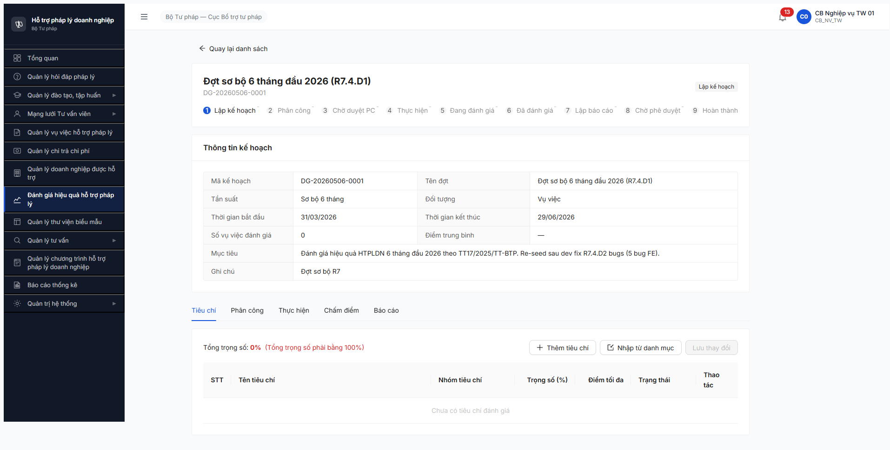
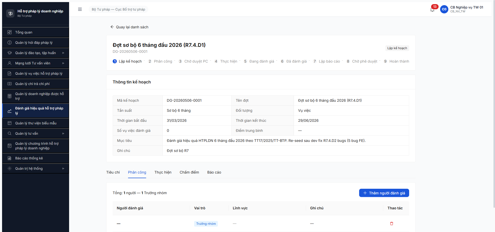
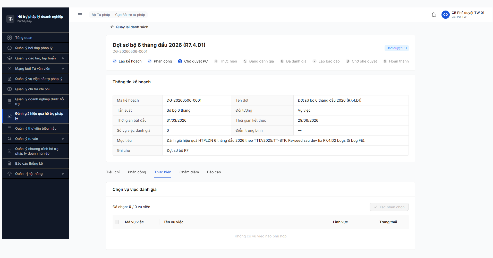

# Workflow Test Report — Đánh giá Hiệu quả HTPLDN (FR-08)

> **Module:** FR-08 Đánh giá Hiệu quả (Nhóm VI) · **SRS:** [`srs-fr-08-danh-gia.md`](../../../../input/srs-v3/srs-fr-08-danh-gia.md) — FR-VI-01 (UC83 Lập KH, line 71-150) + FR-VI-02 (UC84 Tiêu chí, line 151-220) + FR-VI-03 (UC85 Phân công, line 221-290) + FR-VI-04 (Phê duyệt PC) + SCR-VI-01 (line 735-832) + SM-DANHGIA (line 1066-1102) · **Round:** R7 · **Date:** 2026-05-06 · **Tester:** QA Automation
> **Bug:** [`bug-report-flow-danhgia.md`](../bug-reports/bug-report-flow-danhgia.md)

---

## Kết luận

⚠️ **PASS-WITH-BLOCK — 5/11 bước PASS + back-fill tiêu chí PASS, 6/11 BLOCKED do BUG-FUNC-DG-006 (filter `/vu-viec-eligible` empty mặc dù 20 VV state HOAN_THANH thực sự tồn tại trong system, ≥3 VV match date range đợt 01/04-30/06/2026).**

→ Re-investigation 2026-05-06 17:35: phát hiện thêm **2 bug mới R7** (BUG-FUNC-DG-006 Major + BUG-FUNC-DG-007 Medium dashboard KPI mismatch) thay vì thuần dependency block. Cần dev fix filter trước khi B6-B11 có thể test.

**Bonus dev fix verified Closed (5 bug R6):**
- ✅ BUG-FUNC-DG-001 (Medium) — Button [Lưu & Chuyển tiêu chí] giờ navigate đúng Tab Tiêu chí
- ✅ BUG-FUNC-DG-002 (Critical) — Tab Tiêu chí có nút [+ Thêm tiêu chí] / [Nhập từ danh mục] / [Lưu thay đổi]
- ✅ BUG-FUNC-DG-003 (Critical) — Dropdown "Người đánh giá" gọi đúng endpoint `/lookup/danh-gia-vien` (FK NGUOI_DUNG cùng đơn vị) — render 10 NGUOI_DUNG
- ✅ BUG-FUNC-DG-004 (Major) — Dropdown "Lĩnh vực" gọi `/danh-muc?loaiDanhMuc=LINH_VUC_PL` 200 (param key đã sửa từ `loaiDanhMuc=LINH_VUC_PL` cho endpoint `/danh-mucs` 404 → endpoint `/danh-muc` singular 200)
- ✅ BUG-FUNC-DG-005 (Major) — Dropdown "Vai trò" render đúng 2 enum static `Trưởng nhóm / Đánh giá viên`

> **TODO ambiguity SRS** — đã ghi nhận R6.4.D1 + R7.4.D1: SRS Master srs-v3.md có **3 phiên bản state machine ĐG khác nhau** (DB ENUM 6 state vs Workflow Master Phụ lục C.6 7 state vs UI filter 9 trạng thái). File `srs-fr-08-danh-gia.md` line 1066-1102 dùng SM 7 state — test áp theo nguồn này. **App R7 stepper render 9 step** — gần phiên bản 3, label tiếng Việt khác. Cần BA/dev confirm chuẩn nào là canonical.

> **Observation về SM mismatch app vs SRS R6:** R6 spec Bước 2 = `LAP_KE_HOACH → PHAN_CONG`, Bước 3 = `PHAN_CONG → CHO_DUYET_PC`. **Thực tế R7 app:** Submit phân công bằng CB NV → state `PHAN_CONG`; cb_pd duyệt → state `CHO_DUYET_PC`. Order labels có ngược logic so với label tiếng Việt thường ("Chờ duyệt PC" thường nên ở step 3 cho biết đang chờ, sau khi đã duyệt → next state mới phải là Thực hiện). Suy đoán: app đã rename mà chưa update label đúng. Defer log bug — chờ BA confirm SM canonical.

---

## Bảng kiểm tra workflow

| # | Bước (transition) | Actor | Sample test | Status | Bug / Note |
|:-:|---|---|---|:-:|---|
| 1 | `[*] → LAP_KE_HOACH` (Tạo đợt — UC83 / FR-VI-01) | `cb_nv_tw_01` | `DG-20260506-0001` | ✅ | POST `/api/v1/ke-hoach-danh-gias` 201. R7.4.D1 PASS. Button [Lưu & Chuyển tiêu chí] navigate đúng Tab Tiêu chí — **BUG-FUNC-DG-001 Closed** |
| — | (back-fill tiêu chí — FR-VI-02 / UC84) | `cb_nv_tw_01` | DG-0001: 4 tiêu chí TT17 (40+30+20+10=100%) | ✅ | Click [Nhập từ danh mục] → modal multi-select 8 tiêu chí, chọn 4 nhóm "Hiệu quả HTPL" → PUT `/tieu-chis` 200. BR-CALC-04 ✅ Σ=100%. **BUG-FUNC-DG-002 Closed** (action-bar đầy đủ) |
| 2 | `LAP_KE_HOACH → PHAN_CONG` (Phân công người chấm — UC85 / FR-VI-03) | `cb_nv_tw_01` | DG-0001: 1 NGUOI_DUNG `cb_nv_tw_02` vai trò Trưởng nhóm, lĩnh vực Lao động + Hôn nhân gia đình (multi) | ✅ | Modal "Thêm người đánh giá" — 3 dropdowns load OK: Người ĐG (10 NGUOI_DUNG) + Vai trò (2 enum) + Lĩnh vực (10 LV). POST `/phan-congs` 201. **BUG-FUNC-DG-003/004/005 cùng Closed** |
| 3 | (`PHAN_CONG → ?`) Trình duyệt phân công — FR-VI-03 + BR-AUTH-05 | `cb_nv_tw_01` | DG-0001 click [Trình phê duyệt] → confirm dialog | ✅ | POST `/phan-congs/submit` 200. State giữ `PHAN_CONG` (badge "Phân công"). Button [Trình phê duyệt] disappear sau submit. Step 1 stepper ✓ check icon |
| 4 | `PHAN_CONG → CHO_DUYET_PC` (Duyệt PC — FR-VI-04) | `cb_pd_tw_01` | DG-0001 click [Phê duyệt] tại Tab Phân công | ✅ | POST `/phan-congs/approve` 200. State chuyển sang `CHO_DUYET_PC` (badge "Chờ duyệt PC"). Step 1+2 stepper ✓ check icon |
| 5 | `CHO_DUYET_PC → PHAN_CONG` (Từ chối PC — BR-FLOW-04) | `cb_pd_tw_01` | — | ⏭ | Reject path — skip (chỉ 1 đợt, happy path đã pass; deferred test riêng round sau với đợt thứ 2) |
| 6 | `CHO_DUYET_PC → THUC_HIEN` Chọn VV vào đợt (UC87 / FR-VI-05) | `cb_nv_tw_01` | — | ❌ | **BUG-FUNC-DG-006 Major:** Endpoint `GET /vu-viec-eligible` trả `[]` empty mặc dù system có 20 VV state HOAN_THANH (≥3 VV match date range đợt). UI Tab Thực hiện hiện "0/0 VV - Không có VV phù hợp". Filter logic BE có lỗi hoặc cần linh_vuc match người ĐG (chưa rõ spec). |
| 7 | `THUC_HIEN` Chấm điểm VV theo từng tiêu chí | Người được PC (`cb_nv_tw_02`) | — | 🚫 | Cascade B6 BUG-FUNC-DG-006 |
| 8 | `THUC_HIEN → BAO_CAO` (Auto khi chấm xong — FR-VI-06/07 + BR-CALC-04) | System | — | 🚫 | Cascade B6 |
| 9 | `BAO_CAO → CHO_PHE_DUYET` (Trình BC — FR-VI-08) | `cb_nv_tw_01` | — | 🚫 | Cascade B6 |
| 10 | `CHO_PHE_DUYET → HOAN_THANH` (Duyệt BC — FR-VI-09 + BR-AUTH-05) | `cb_pd_tw_01` | — | 🚫 | Cascade B6 |
| 11 | `CHO_PHE_DUYET → BAO_CAO` (Từ chối BC — FR-VI-09 + BR-FLOW-04) | `cb_pd_tw_01` | — | ⏭ | Reject path — skip cùng B5 |

> Icon: ✅ pass · ❌ fail · ⏭ skip (defer external/cron) · 🚫 blocked (cascade upstream) · — chưa test

---

## Lịch sử round

| Round | Date | Kết quả tóm tắt (1 dòng) |
|---|---|---|
| R14 (R6) | 02/05 | 1/11 PASS B1. 10/11 BLOCKED do 5 bug FE (2 Critical + 2 Major + 1 Medium) chặn từ Bước 2 (phân công) trở đi và back-fill tiêu chí ở Bước 1. |
| **R7** | **06/05** | **5/11 PASS (B1+B2+B3+B4 + back-fill tiêu chí). B6 ❌ FAIL by BUG-FUNC-DG-006 (filter `/vu-viec-eligible` empty mặc dù 20 VV HOAN_THANH tồn tại) → cascade B7-B10 🚫. 5/5 R6 bug Closed verified. 2 bug mới R7 (DG-006 Major + DG-007 Medium dashboard KPI mismatch).** |

---

## Bằng chứng

**Bước 1 + back-fill tiêu chí — DG-20260506-0001 state Lập kế hoạch + Tab Tiêu chí 4 records (Σ=100%)**



**Bước 2 — Add người ĐG: 3 dropdowns load đúng SRS (BUG-DG-003/004/005 Closed)**



**Bước 4 — cb_pd_tw_01 Phê duyệt PC + B6 block (state CHO_DUYET_PC + Tab Thực hiện 0 VV phù hợp)**



```text
Network log (key transitions):

B1: POST /api/v1/ke-hoach-danh-gias [201]               (R7.4.D1 done)
Tiêu chí: PUT /api/v1/ke-hoach-danh-gias/{id}/tieu-chis [200]   (BR-CALC-04 sum=100)
B2: POST /api/v1/ke-hoach-danh-gias/{id}/phan-congs [201]
B3: POST /api/v1/ke-hoach-danh-gias/{id}/phan-congs/submit [200]
B4: POST /api/v1/ke-hoach-danh-gias/{id}/phan-congs/approve [200]   (cb_pd_tw_01)
B6: GET  /api/v1/ke-hoach-danh-gias/{id}/vu-viec-candidates? [200] → [] empty
```

```text
Dependency state verify (CB NV TW dashboard 17:25):
- Hỏi đáp mới: 6
- Vụ việc tiếp nhận: 76
- Vụ việc đang xử lý: 76
- Vụ việc hoàn thành: 0   ← block B6-B11
- Đào tạo đang diễn ra: 0
- Đào tạo hoàn thành: 0
- Chuyên gia / Tư vấn viên: 0

→ R7.4.A3 (Workflow VV) chưa run → 0 VV state HOAN_THANH → đợt ĐG đối tượng "Vụ việc" không có VV match → B6 block.
```

```text
SRS verify R7 vs R6 bug Closed:
(a) grep srs-fr-08-danh-gia.md local: line 71-247 (FR-VI-01/02/03 spec) + line 776-832 (SCR-VI-01 form Tạo + Tab Tiêu chí + Tab Phân công).
(b) UI test 2026-05-06: 4 endpoints + 4 dropdowns work as spec. R6 bug 003 endpoint /chuyen-gia-tvvs 404 → R7 endpoint mới /lookup/danh-gia-vien 200 (FK NGUOI_DUNG cùng đơn vị đúng SRS line 244). R6 bug 004 path /danh-mucs 404 → R7 path /danh-muc 200 (singular). R6 bug 005 dropdown empty → R7 render đúng 2 enum SRS line 245.
```

---

*R7 | 2026-05-06 | QA Automation via Chrome DevTools MCP*
