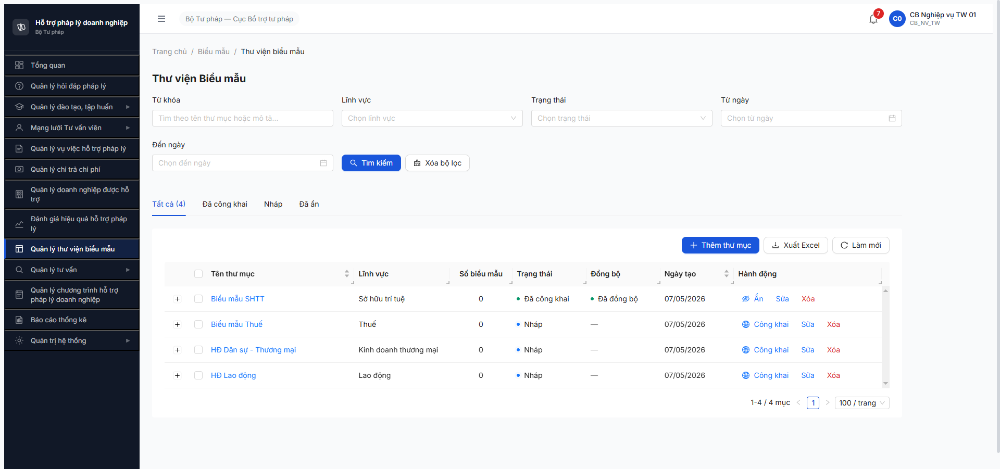

# Workflow Test Report — Biểu mẫu (FR-VII v3.5) — R7.4.C1

> **Module:** Thư viện Biểu mẫu — SM-BIEUMAU 3 transition + Switch công khai 4 trường + BR-PUBLIC-01/02/03 · **SRS:** [`_DELTA-MAP-FR09.md`](../../../input/srs-update-2026-5-5/_DELTA-MAP-FR09.md) + [`CHANGELOG-v3-to-v3.5.md` line 1010-1117](../../../input/srs-update-2026-5-5/CHANGELOG-v3-to-v3.5.md) + [`srs-fr-12-tv-chuyen-sau.md` line 1597-1613 (BR-PUBLIC-01/02/03)](../../../input/srs-update-2026-5-5/srs-fr-12-tv-chuyen-sau.md) · **Round:** R7 · **Date:** 2026-05-07 · **Tester:** QA Automation (Claude Code MCP)
> **Bug:** [`bug-reports/bm/bug-report-flow-bm-r7-4-c1.md`](../bug-reports/bm/bug-report-flow-bm-r7-4-c1.md)

---

## Kết luận

⚠️ **PASS-WITH-NOTE — 5/8 checkpoints PASS, 1 BLOCKED, 6 bug Critical/Major/Medium**

- ✅ **3/3 SM-BIEUMAU transitions** PASS ở thư mục (NHAP→CONG_KHAI→AN→CONG_KHAI) — BE state machine hoạt động đúng.
- ✅ **BR-PUBLIC-01** PASS ở BE (HTTP 409 + `ERR-CK-01` khi công khai TM rỗng) — nhưng FE silent fail (BUG-BM-005).
- ✅ **BR-PUBLIC-03** PASS partial — BE auto-fill `ngayCongKhai` khi cong_khai 0→1, không có UI input cho user sửa tay.
- ❌ **BR-PUBLIC-02** FAIL — `ngayCongKhai` không clear khi BM chuyển sang AN (BUG-BM-002 Critical).
- 🚫 **Switch công khai 4 trường (BM level)** BLOCKED — UI chưa render Switch + 3 fields mới (BUG-BM-001 Critical), BE entity thiếu 3 cột (BUG-BM-004 Major) + tên field cũ chưa rename (BUG-BM-003 Major).

> **Note seed:** R7.3.7 chỉ seed 4 TM ở NHAP, BM 0/7 defer (env limit thiếu file .docx). Round này tự seed 1 BM qua UI bằng file `test-bm-r7-4-c1.docx` 917B (Python tạo zip `.docx` minimal hợp lệ) → BM-20260507-001 lưu thành công, đủ điều kiện chạy SM thư mục.

> **TODO ambiguity SRS:** Delta-Map FR-09 D.2 ghi rõ "KHÔNG thêm 4 fields công khai cho thư mục — chỉ rename `la_cong_khai → cong_khai`" nhưng BUG-BM-001 vẫn áp dụng cho FORM BM (không phải TM). Tách rõ trong test BR-PUBLIC để không nhầm scope.

---

## Bảng kiểm tra workflow

| # | Bước (transition / kiểm tra) | Actor | Sample test | Status | Bug / Note |
|:-:|---|---|---|:-:|---|
| 1 | Login + navigate `/bieu-mau/thu-muc` | `cb_nv_tw_01` | — | ✅ | Sidebar render OK, list TM 4/4 hiển thị (Biểu mẫu SHTT / Biểu mẫu Thuế / HĐ Dân sự - Thương mại / HĐ Lao động) |
| 2 | Verify form **Thêm BM** có 4 trường công khai (Switch + Ảnh CK + Mô tả CK + File CK) | `cb_nv_tw_01` | URL `/bieu-mau/them-moi` | ❌ | [BUG-BM-001](../bug-reports/bm/bug-report-flow-bm-r7-4-c1.md#bug-bm-001--form-thêmsửa-biểu-mẫu-thiếu-4-trường-công-khai-theo-srs-v35) — form chỉ có 7 fields v3 cũ |
| 3 | Verify form **Sửa BM** có 4 trường công khai | `cb_nv_tw_01` | URL `/bieu-mau/{id}/sua` | ❌ | BUG-BM-001 (cùng bug, evidence riêng) — form Sửa cũng thiếu |
| 4 | **BR-PUBLIC-01** — Công khai TM rỗng (chưa có BM) phải reject | `cb_nv_tw_01` | TM SHTT (0 BM) | ⚠️ | BE PASS (409 `ERR-CK-01` "Thư mục rỗng — không thể công khai khi chưa có biểu mẫu") · UI FAIL silent → [BUG-BM-005](../bug-reports/bm/bug-report-flow-bm-r7-4-c1.md#bug-bm-005--ui-silent-fail-khi-be-trả-409-err-ck-01-công-khai-thư-mục-rỗng) |
| 5 | **Seed 1 BM** qua UI để unblock SM (test-bm-r7-4-c1.docx 917B) | `cb_nv_tw_01` | BM-20260507-001 | ✅ | POST `/bieu-maus` 200 → BM trong NHAP. Cột "Số biểu mẫu" trên TM list KHÔNG update → [BUG-BM-006](../bug-reports/bm/bug-report-flow-bm-r7-4-c1.md#bug-bm-006--cột-số-biểu-mẫu-trên-list-thư-mục-không-cập-nhật-sau-khi-thêm-bm) |
| 6 | **SM-BIEUMAU T1** — `NHAP → CONG_KHAI` (button "Công khai" + BR-PUBLIC-03 auto-fill timestamp) | `cb_nv_tw_01` | TM SHTT | ✅ | POST `/thu-muc-bieu-maus/{id}/cong-khai` 200. TM `trangThai=CONG_KHAI`, `syncStatus=SYNCED`. BM cascade: `laCongKhai=true`, `ngayCongKhai="2026-05-07T11:26:54.611Z"` (auto-fill BR-PUBLIC-03 OK ở BE). Toast "Đã công khai thư mục lên Cổng PLQG" hiện. |
| 7 | **SM-BIEUMAU T2** — `CONG_KHAI → AN` (button "Ẩn" + BR-PUBLIC-02 clear timestamp) | `cb_nv_tw_01` | TM SHTT | ⚠️ | POST `/thu-muc-bieu-maus/{id}/an` 200, TM `trangThai=AN`. **BR-PUBLIC-02 FAIL**: BM `laCongKhai=false` ✅ nhưng `ngayCongKhai="2026-05-07T11:26:54.611Z"` KHÔNG clear → [BUG-BM-002](../bug-reports/bm/bug-report-flow-bm-r7-4-c1.md#bug-bm-002--br-public-02-vi-phạm-ngaycongkhai-không-clear-khi-bm-chuyển-sang-an) Critical. |
| 8 | **SM-BIEUMAU T3** — `AN → CONG_KHAI` (re-publish) | `cb_nv_tw_01` | TM SHTT | ✅ | POST `/thu-muc-bieu-maus/{id}/cong-khai` 200, TM về `CONG_KHAI`. Toast "Đã công khai thư mục lên Cổng PLQG" hiện. |
| 9 | **BR-PUBLIC-03** — auto-fill `thoi_gian_dang_tai`, không cho sửa tay | `cb_nv_tw_01` | BM-20260507-001 | ✅ | BE tự gán `ngayCongKhai` khi `laCongKhai=1`. UI form Sửa KHÔNG có input `thoiGianDangTai` (thiếu hiển thị nhưng đúng spec "không cho sửa tay"). |
| 10 | **Verify entity rename** (`la_cong_khai → cong_khai`, `ngay_cong_khai → thoi_gian_dang_tai`) | API check | `/bieu-maus/{id}` | ❌ | [BUG-BM-003](../bug-reports/bm/bug-report-flow-bm-r7-4-c1.md#bug-bm-003--be-bieu_mau-chưa-rename-lacongkhai--congkhai--ngaycongkhai--thoigiandangtai) — BE vẫn trả `laCongKhai`, `ngayCongKhai` |
| 11 | **Verify 3 fields công khai mới** (`anh_dai_dien`, `mo_ta_cong_khai`, `file_dinh_kem_cong_khai`) | API check | `/bieu-maus/{id}` | ❌ | [BUG-BM-004](../bug-reports/bm/bug-report-flow-bm-r7-4-c1.md#bug-bm-004--be-bieu_mau-entity-thiếu-3-fields-công-khai-mới) — BIEU_MAU entity thiếu cả 3 |

> Icon: ✅ pass · ❌ fail · ⚠️ partial / pass-with-note · 🚫 blocked · — chưa test

---

## Lịch sử round

| Round | Date | Kết quả tóm tắt |
|---|---|---|
| R7 (lần 1) | 2026-05-07 | 5/8 PASS + 6 bug. SM 3/3 transition PASS ở TM. BR-PUBLIC-01 BE OK / UI silent. BR-PUBLIC-02 FAIL (timestamp not cleared). BR-PUBLIC-03 BE OK. Switch + 4 fields công khai BLOCKED do FE chưa build + BE entity thiếu cột. |

---

## Bằng chứng (round mới nhất)

### Step 4 — BR-PUBLIC-01 PASS BE / FAIL UI

```text
POST /api/v1/thu-muc-bieu-maus/59f01d24-447b-4195-9841-d7240e91be9e/cong-khai (TM rỗng)
Status: 409
Body:
{
  "success": false,
  "error": {
    "code": "ERR-CK-01",
    "message": "Thư mục rỗng — không thể công khai khi chưa có biểu mẫu",
    "timestamp": "2026-05-07T11:21:40.306Z"
  }
}
DOM check: 0 toast, 0 notification, 0 form-error
```


### Step 6 — SM T1 NHAP→CONG_KHAI PASS


### Step 7 — SM T2 CONG_KHAI→AN PASS state nhưng BR-PUBLIC-02 FAIL

```text
GET /api/v1/bieu-maus/0f425c10-8bfd-4dcd-ac34-e724135a2872 (sau Ẩn)
{
  "trangThai": "AN",
  "laCongKhai": false,                           ← OK (cờ flip)
  "ngayCongKhai": "2026-05-07T11:26:54.611Z",   ← FAIL (phải NULL theo BR-PUBLIC-02)
  "syncStatus": "SUCCESS"
}
```


### Step 8 — SM T3 AN→CONG_KHAI PASS



---

*R7 | QA Automation via Claude Code MCP | 2026-05-07 18:30*
