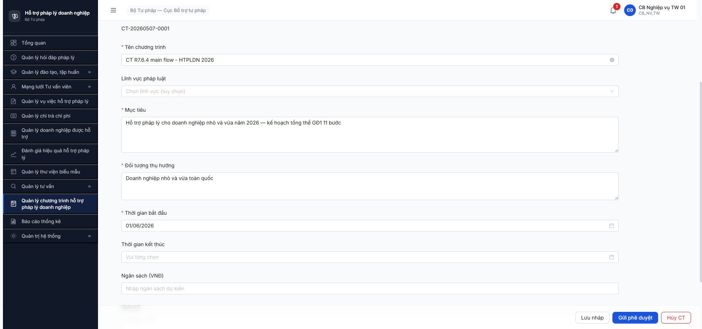
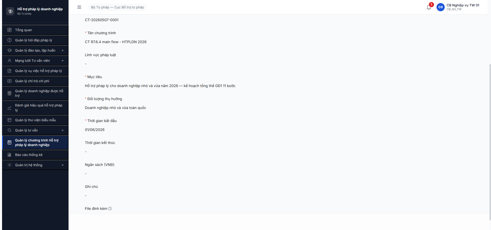
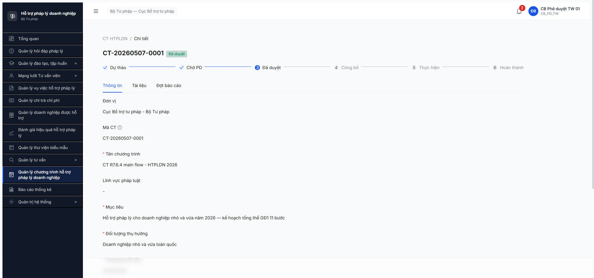
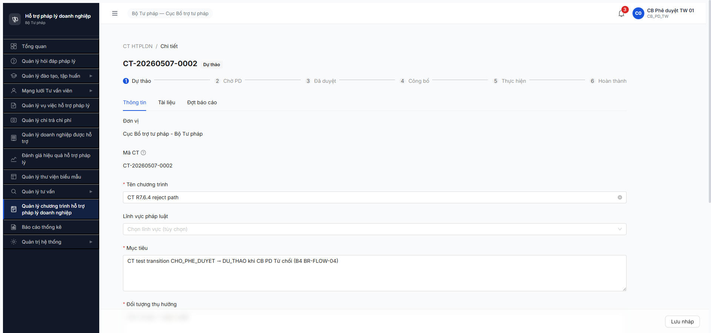
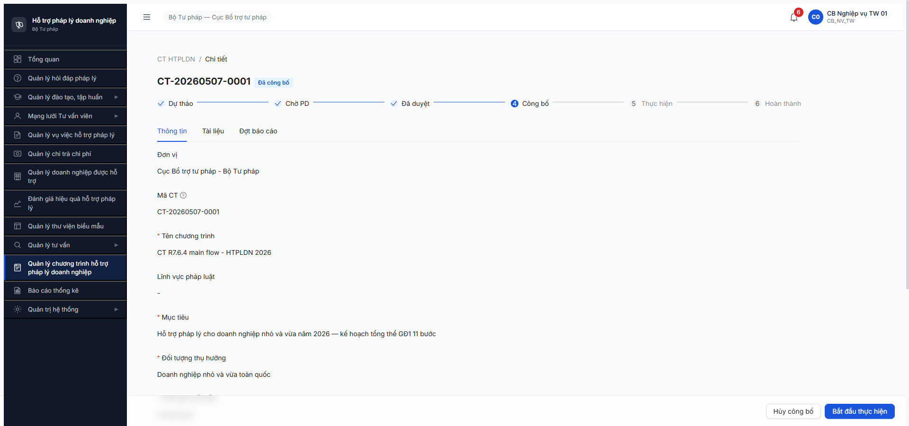
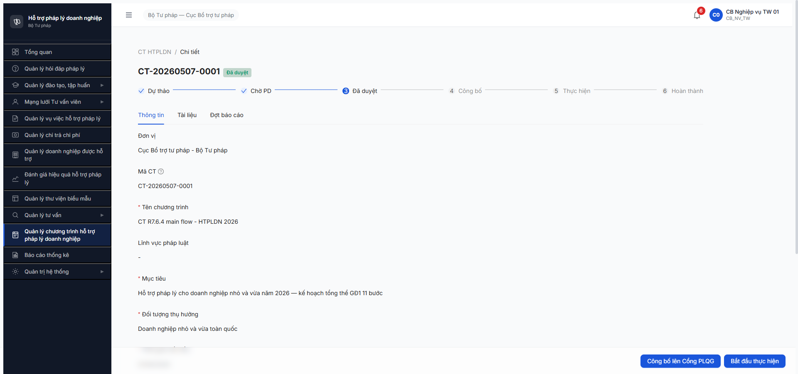
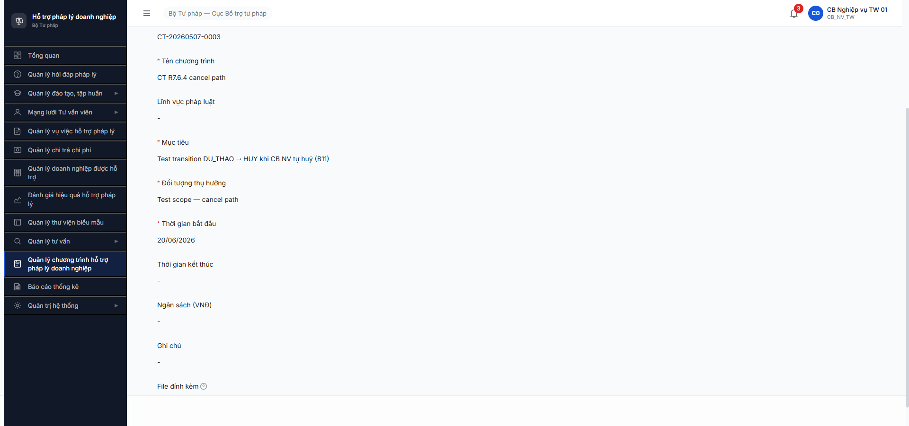
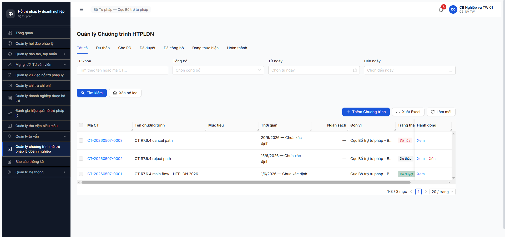

# Workflow Test Report — Chương trình HTPLDN Giai đoạn 1

> **Module:** Quản lý Chương trình HTPLDN GĐ1 (FR-XI-01..05 / SM-CHUONG_TRINH_HTPL) · **SRS:** [`02-thu-tu-module.md §⑤`](../../../../input/quy-trinh-nghiep-vu/02-thu-tu-module.md) + [`srs-fr-15-ct-htpldn.md`](../../../../input/srs-v3/srs-fr-15-ct-htpldn.md) · **Round:** R7.6.4 · **Date:** 2026-05-07 · **Tester:** QA Automation (Claude Code via Chrome DevTools MCP)
> **Bug:** [`bug-report-flow-cthtpldn.md`](../bug-reports/ct-htpldn/bug-report-flow-cthtpldn.md)

---

## Kết luận

⚠️ **PASS-WITH-NOTE — 7/11 bước PASS (63.6%)**. B1/B2/B3/B4/B5/B6/B11 PASS theo spec. **B7 FAIL — BE 409 `ERR-VAL-XI-06-11` (BUG-CTHTPLDN-B7-001 Major)** → cascade BLOCK B8/B9/B10. CT1 dừng ở `DA_DUYET`, không vào được `DANG_THUC_HIEN` mặc dù SRS line 903 chỉ yêu cầu state DA_DUYET hoặc DA_CONG_BO. **R7.6.5 (GĐ2 Đợt BC) tiếp tục bị block** vì cần ≥1 CT ở DANG_THUC_HIEN.

> **Regression so với R6.6.4:** R6 PASS 11/11 với cùng bộ 3 CT samples (CT1/CT2/CT3). R7 fail B7 do BE thêm validation mới (`ke_hoach_chi_tiet` + `don_vi_thuc_hien`) trong khi FE form và spec FR-XI không có 2 field này → BE/FE/SRS contract mismatch.

---

## Bảng kiểm tra workflow

| # | Bước (transition) | Actor | Sample test | Status | Bug / Note |
|:-:|---|---|---|:-:|---|
| 1 | `— → DU_THAO` (Tạo CT thủ công UC164, [Tạo chương trình]) | `cb_nv_tw_01` | CT-20260507-0001 | ✅ | Form 4 trường bắt buộc + auto sinh mã `CT-20260507-{SEQ}`. Đơn vị auto = "Cục Bổ trợ tư pháp - Bộ Tư pháp". Stepper 6 bước render đúng. |
| 2 | `DU_THAO → CHO_PHE_DUYET` ([Gửi phê duyệt]) | `cb_nv_tw_01` | CT-20260507-0001 | ✅ | Submit trực tiếp không có modal xác nhận. Stepper bước 1 check (✓), bước 2 active. Form chuyển read-only. |
| 3 | `CHO_PHE_DUYET → DA_DUYET` ([Phê duyệt]) | `cb_pd_tw_01` | CT-20260507-0001 | ✅ | Modal "Phê duyệt chương trình?" → Đồng ý. Toast "Phê duyệt thành công". Stepper bước 2 check, bước 3 active. BR-AUTH-05 cùng cấp TW PASS. |
| 4 | `CHO_PHE_DUYET → DU_THAO` ([Từ chối] + lý do ≥10 ký tự) | `cb_pd_tw_01` | CT-20260507-0002 | ✅ | Modal "Từ chối chương trình" có textarea Lý do từ chối required + counter `0/1000` (BR-FLOW-04). Lý do test 124 ký tự PASS. State quay về Dự thảo, form editable lại. |
| 5 | `DA_DUYET → DA_CONG_BO` ([Công bố lên Cổng PLQG]) | `cb_nv_tw_01` | CT-20260507-0001 | ✅ | Modal "Công bố lên Cổng PLQG?" → Đồng ý. State Đã công bố. Stepper bước 3 check. (FR-XII-15 push API ngoài scope smoke.) Network: `POST /publish` → 200. |
| 6 | `DA_CONG_BO → DA_DUYET` ([Hủy công bố]) | `cb_nv_tw_01` | CT-20260507-0001 | ✅ | Modal "Hủy công bố?" → Đồng ý. State quay về Đã duyệt, stepper bước 3 unchecked. Network: `POST /unpublish` → 200. |
| 7 | `DA_DUYET → DANG_THUC_HIEN` ([Bắt đầu thực hiện]) | `cb_nv_tw_01` | CT-20260507-0001 | ❌ | **BUG-CTHTPLDN-B7-001 Major** — BE trả 409 `ERR-VAL-XI-06-11` "Chỉ có thể kích hoạt khi có kế hoạch chi tiết và đơn vị thực hiện" trong khi FE form FR-XI-01 + spec MH-CT-01 KHÔNG có 2 field này. Reproduced 2 lần liên tiếp (reqid=776 và reqid=940). Modal đóng nhưng UI silent (không toast). State giữ nguyên DA_DUYET. |
| 8 | `DANG_THUC_HIEN → TAM_DUNG` ([Tạm dừng] + lý do) | `cb_nv_tw_01` | CT-20260507-0001 | 🚫 | Cascade block từ B7 — không đạt được DANG_THUC_HIEN. |
| 9 | `TAM_DUNG → DANG_THUC_HIEN` ([Tiếp tục]) | `cb_nv_tw_01` | CT-20260507-0001 | 🚫 | Cascade block từ B7. |
| 10 | `DANG_THUC_HIEN → HOAN_THANH` ([Hoàn thành]) | `cb_nv_tw_01` | CT-20260507-0001 | 🚫 | Cascade block từ B7. |
| 11 | `DU_THAO → HUY` ([Hủy CT] + xác nhận) | `cb_nv_tw_01` | CT-20260507-0003 | ✅ | Modal "Hủy chương trình? Hành động này không thể hoàn tác." → Đồng ý. State Đã hủy, stepper ẩn (đúng spec — TAM_DUNG/HUY ẩn khỏi stepper). Không còn action button. |

> Icon: ✅ pass · ❌ fail · 🚫 blocked (cascade upstream) · ⏭ skip · — chưa test

**Tổng:** 7/11 PASS (63.6%) · 1/11 FAIL (B7) · 3/11 BLOCKED cascade (B8/B9/B10).

---

## Lịch sử round

| Round | Date | Kết quả tóm tắt (1 dòng) |
|---|---|---|
| R6.6.4 | 2026-05-05 | PASS 11/11 transitions với CT-20260505-0001..0003. Unblock R6.6.5 + R6.7.15. |
| R7.6.4 | 2026-05-07 | ⚠️ 7/11 PASS — B7 FAIL do BE thêm validation `ERR-VAL-XI-06-11` (regression vs R6). Cascade block B8-B10. CT1 dừng `DA_DUYET`, CT2 `DU_THAO` (sau từ chối), CT3 `DA_HUY`. |

---

## Tài khoản dùng

| Username | Vai trò | Cấp | Dùng cho bước |
|---|---|---|---|
| `cb_nv_tw_01` | CB_NV_TW (Cán bộ Nghiệp vụ TW) | TW | 1, 2, 5, 6, 7 (failed), 11 |
| `cb_pd_tw_01` | CB_PD_TW (Cán bộ Phê duyệt TW) | TW | 3 (CT1), 4 (CT2) |

Pattern multi-role: dùng MCP `isolatedContext: cb_pd_tw_01` mở session riêng cho CB PD; CT1 + CT2 visible cross context (cùng cấp TW). Lưu ý: cả 2 context bị logout sau ~5 phút idle khi đang ở modal Từ chối — re-login OK lần 2 (1 lần BE 500 transient, retry PASS).

---

## Bằng chứng

### B1 — CT1 created `DU_THAO`


### B2 — CT1 `CHO_PHE_DUYET`


### B3 — CT1 `DA_DUYET` (cb_pd_tw_01 phê duyệt)


### B4 — CT2 `DU_THAO` sau từ chối


### B5 — CT1 `DA_CONG_BO`


### B7 — BE 409 silent (BUG)


```text
POST /api/v1/chuong-trinh-htpls/95d2a599-8b3c-458b-b542-ed160ce4c529/activate
Request body: {"version":5}
Response 409:
{
  "success": false,
  "error": {
    "code": "ERR-VAL-XI-06-11",
    "message": "Chi co the kich hoat khi co ke hoach chi tiet va don vi thuc hien",
    "timestamp": "2026-05-07T09:16:02.742Z",
    "requestId": "f806fe93-93f1-47be-a0e9-213c82b2a4cc"
  }
}
```

### B11 — CT3 `DA_HUY` (Đã hủy)


### List danh sách 3 CT cuối round


---

## Output cho task downstream

| Task | Trạng thái sau R7.6.4 | Lý do |
|---|---|---|
| **R7.6.5** Workflow CT HTPLDN GĐ2 Đợt BC | 🚫 vẫn block | Cần ≥1 CT GĐ1 ở DANG_THUC_HIEN. Hiện CT1 dừng tại DA_DUYET do B7 fail. |
| **R7.7.15** Functional CT HTPLDN (42 TC) | 🟢 unblock 1 phần | Menu OK + 3 CT đa state (DU_THAO/DA_DUYET/DA_HUY) — đủ test 30+ TC negative + perm + edge. Nhóm TC liên quan workflow forward (DANG_THUC_HIEN/TAM_DUNG/HOAN_THANH/Đợt BC) defer chờ B7 fix. |
| **R7.E2** CT HTPLDN GĐ1 monitor | ✅ done | 3 CT data tồn tại (verify endpoint thực tế = `/api/v1/chuong-trinh-htpls`, không phải `/chuong-trinh-htpl`). |

---

## Phụ lục — Môi trường test

| Thành phần | Giá trị |
|------------|---------|
| URL ứng dụng | http://103.172.236.130:3000/ |
| OTP login | `666666` bypass |
| API base | `/api/v1/chuong-trinh-htpls` (endpoint số nhiều, không phải số ít) |
| Tool test | Chrome DevTools MCP (primary per CLAUDE.md routing rule) |

---

*R7.6.4 | 2026-05-07 | QA Automation (Claude Code via Chrome DevTools MCP, isolated context multi-role)*
