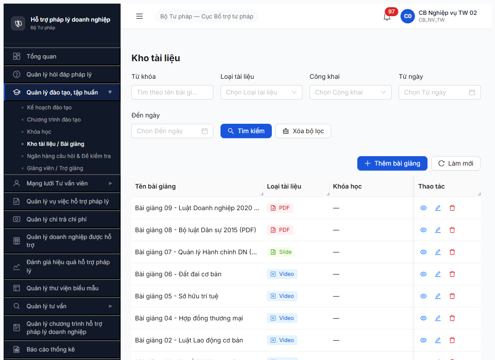

# Bug Report — Bài giảng (R7.3.10 R8)

| Thông tin | Giá trị |
|-----------|---------|
| **Dự án** | PM HTPLDN |
| **Môi trường** | http://103.172.236.130:3000 |
| **Người test** | QA Automation (Claude Code + Chrome DevTools MCP) |
| **Ngày** | 2026-05-08 20:48–20:50 |
| **Loại test** | Seed (Tier 2 transactional — BAI_GIANG) |
| **Round** | Round 8 |
| **Tài liệu tham chiếu** | [FR-III-07 UC26](../../../../input/srs-update-2026-5-5/srs-fr-03-dao-tao.md#fr-iii-07) · [seed-checklist R8](../../seed/dao-tao/seed-checklist-r7-3-10-bai-giang.md) |

---

## Tổng hợp

Phát hiện **1 lỗi Major** trong quá trình seed BAI_GIANG R8: BE thiếu validation `fileBaiGiang/urlYoutube` theo `loaiTaiLieu`, vi phạm SRS FR-III-07 Inputs row 4-5 + Error Handling E2 "ERR-BG-02 sai định dạng".

> **Rule log bug:** Có SRS reference cụ thể (FR-III-07 Inputs row 4 + Error E2). Đây là missing validation guard ở BE, không phải FE bug.

### Severity breakdown

| Tổng | Critical | Major | Medium | Minor | Trivial |
|------|----------|-------|--------|-------|---------|
| 1    | 0        | 1     | 0      | 0     | 0       |

## Bug Summary Table

| Bug ID | Severity | Priority | Type | TC Ref | **SRS Reference** | Title | Status |
|--------|----------|----------|------|--------|-------------------|-------|--------|
| BUG-BG-001 | Major | P1 | Negative | R7.3.10-R8 | `FR-III-07 Inputs row 4 line 648` (`file_bai_giang Cond: bắt buộc nếu SLIDE/PDF`) + `Error Handling E1/E2 line 689-690` (`ERR-BG-01/02`) | BE missing validation `fileBaiGiang/urlYoutube` theo `loaiTaiLieu` — POST với fileBaiGiang=null/omitted vẫn 201 Created cho PDF/SLIDE | Open |

---

## BUG-BG-001 — BE missing validation `fileBaiGiang/urlYoutube` theo `loaiTaiLieu`

### Mô tả

Endpoint `POST /api/v1/bai-giangs` chấp nhận body với `loaiTaiLieu = SLIDE/PDF/VIDEO` nhưng KHÔNG kiểm tra trường `fileBaiGiang` (cho SLIDE/PDF) hoặc `urlYoutube` (cho VIDEO). 6 shape khác nhau (null, string URL bất kỳ, object đa dạng key, omitted) đều trả `201 Created` thay vì 422 với mã `ERR-BG-02 "Chỉ chấp nhận file Slide hoặc PDF"`. Vi phạm SRS Inputs row 4 quy định "Cond: bắt buộc nếu SLIDE/PDF" + Processing Bước 3 "Nếu Slide/PDF: kiểm tra file ≤ 20MB, đúng định dạng" (line 663).

### Các bước tái hiện

1. Login `cb_nv_tw_02`. Vào dashboard.
2. Console DevTools / curl với access_token: `POST /api/v1/bai-giangs` body 6 shape:
   ```
   { tenBaiGiang: "X", moTa: "X", loaiTaiLieu: "PDF" }                                      // omit fileBaiGiang
   { ..., fileBaiGiang: null }                                                              // null
   { ..., fileBaiGiang: "/uploads/dummy.pdf" }                                              // string
   { ..., fileBaiGiang: { url: "...", name: "...", size: 1024 } }                           // object schema A
   { ..., fileBaiGiang: { fileUrl: "...", fileName: "..." } }                               // object schema B
   { ..., fileBaiGiang: { id: "some-id", name: "dummy.pdf" } }                              // object schema C
   ```
3. Quan sát BE response cho mỗi shape.

### Kết quả mong đợi

- Theo `FR-III-07 Inputs row 4`: `file_bai_giang` field bắt buộc khi `loaiTaiLieu IN (SLIDE, PDF)`.
- Theo `Processing Bước 3`: BE phải validate file ≤ 20MB + đúng định dạng.pptx/.pdf.
- Theo `Error Handling`:
  - E1 `ERR-BG-01`: file vượt 20MB
  - E2 `ERR-BG-02`: file sai định dạng
- POST với `fileBaiGiang=null/omitted/wrong-shape` cho `loaiTaiLieu=PDF/SLIDE` phải reject 422 với mã `ERR-BG-02` hoặc validation tương tự.

### Kết quả thực tế

- Cả 6 shape đều trả `201 Created` thành công.
- BE silently drop nested object → lưu `fileUrl: null, dungLuong: null` cho 3 record (Probe shape A/B/C).
- Tương tự test cho `loaiTaiLieu=VIDEO + urlYoutube=null/omitted` cũng nghi 201 (chưa probe nhưng pattern same).
- Hậu quả: tester/dev có thể tạo "phantom" bài giảng (loại PDF nhưng không có file) → broken flow downstream khi user click preview/download.

### Bằng chứng

**1. Ảnh chụp** *(list 8 BG sau khi seed + cleanup)*:



**2. API response cho 6 probe shape (đã DELETE record)**:

```json
// Probe 1: omit fileBaiGiang
POST /api/v1/bai-giangs
body: { "tenBaiGiang": "Probe", "moTa": "Test", "loaiTaiLieu": "PDF" }
response: 201 Created   ← ❌ phải reject vì PDF cần file

// Probe 2: fileBaiGiang=null
body: { ..., "fileBaiGiang": null }
response: 201 Created   ← ❌

// Probe 3-6: object/string variations
all 4 → 201 Created     ← ❌ silently dropped

// Probe verify post-create:
GET /api/v1/bai-giangs/{id}
response.fileUrl: null
response.dungLuong: null
```

→ Cả 6 trường hợp đều bypass validation. Phantom record được tạo.

### So sánh — *N/A* (không phải bug phân quyền)

---

## Phụ lục — Môi trường test

| Thành phần | Giá trị |
|------------|---------|
| URL ứng dụng | http://103.172.236.130:3000 |
| OTP login | `666666` (bypass tạm) |
| API base | http://103.172.236.130:3000/api/v1 |
| Frontend | React + Vite + Ant Design |
| Xác thực | JWT + OTP |
| Tool test | Chrome DevTools MCP (`mcp__chrome-devtools__*`) |
| Account | cb_nv_tw_02 (CB_NV_TW BTP) |

---

*Bug report generated: 2026-05-08 20:55 | QA Automation via Claude Code (Chrome DevTools MCP)*
