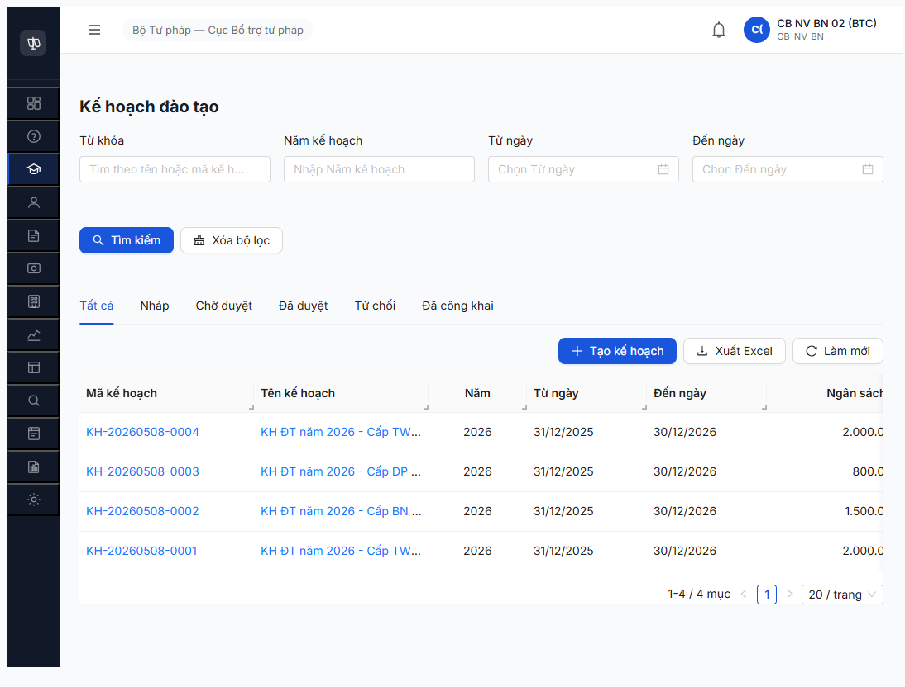
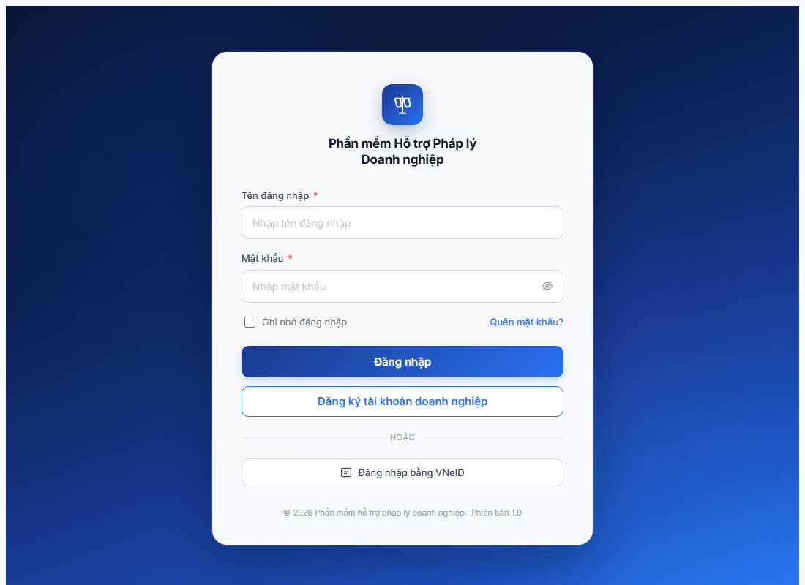
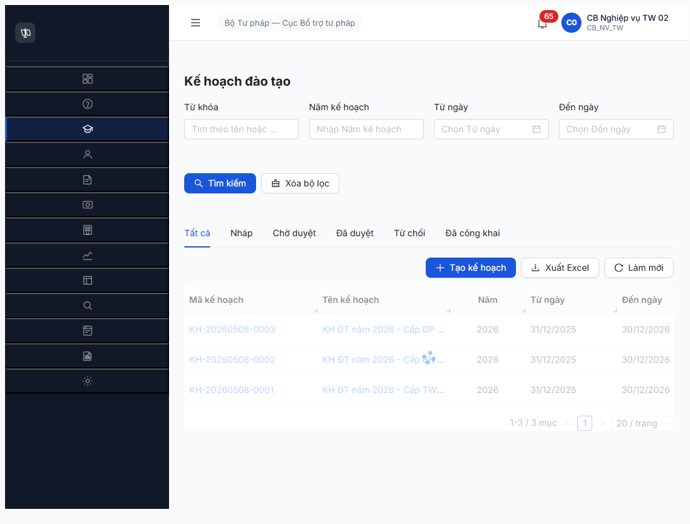

# Bug Report — Kế hoạch đào tạo năm (R7.3.5 — R8 re-run)

| Thông tin | Giá trị |
|-----------|---------|
| **Dự án** | PM HTPLDN — Phần mềm Hỗ trợ Pháp lý Doanh nghiệp |
| **Môi trường** | http://103.172.236.130:3000 |
| **Người test** | QA Automation (Claude Code + Chrome DevTools MCP) |
| **Ngày** | 2026-05-08 18:23–18:42 |
| **Loại test** | Seed (Mô hình A 3 cấp KH năm — re-run R8) |
| **Round** | Round 8 |
| **Tài liệu tham chiếu** | [FR-III-14 UC33](../../../../input/srs-update-2026-5-5/srs-fr-03-dao-tao.md#fr-iii-14) · [seed-checklist-r7-3-5](../../seed/dao-tao/seed-checklist-r7-3-5-kh-nam.md) |

---

## Tổng hợp

Phát hiện **3 lỗi có SRS reference cụ thể** trong quá trình re-seed KH năm 3 cấp Mô hình A:
1. **Backend cross-tenant data leak** — vi phạm BR-AUTH-08, re-confirm từ R7 với evidence backend (donViId mismatch).
2. **UI thiếu nút "Xoá"** trên chi tiết kế hoạch trạng thái Nháp — vi phạm FR-III-14 Processing-Xóa Bước 1-5 (backend hỗ trợ DELETE 204).
3. **Date timezone off-by-one ở backend** — input `01/01/2026` lưu thành `2025-12-31` (re-confirm từ R7 nhưng xác định gốc ở backend, không phải display).

> **Rule log bug:** mọi bug đều có SRS reference cụ thể (FR-III-14, BR-AUTH-08).

### Severity breakdown

| Tổng | Critical | Major | Medium | Minor | Trivial |
|------|----------|-------|--------|-------|---------|
| 3    | 0        | 2     | 1      | 0     | 0       |

## Bug Summary Table

| Bug ID | Severity | Priority | Type | TC Ref | **SRS Reference** | Title | Status |
|--------|----------|----------|------|--------|-------------------|-------|--------|
| BUG-KH-001 | Major | P0 | Permission | R7.3.5-R8 | `BR-AUTH-08 line 1903` + `FR-III-14 Processing-Xem danh sách Bước 2 BR-DATA-02` | Backend trả KH năm cross-đơn vị — CB NV bất kỳ cấp đều thấy KH năm của tất cả 3 cấp | Open |
| BUG-KH-002 | Major | P1 | UI/UX | R7.3.5-R8 | `FR-III-14 Processing-Xóa Bước 1-5 line 1037-1045` | UI chi tiết KH năm Nháp thiếu nút "Xoá" mặc dù backend cho DELETE 204 | Open |
| BUG-KH-003 | Medium | P2 | Data | R7.3.5-R8 | `FR-III-14 Inputs row 3-4 line 991-992` | Date timezone off-by-one ở backend — input `01/01/2026` lưu thành `2025-12-31` | Open |

---

## BUG-KH-001 — Backend trả KH năm cross-đơn vị (vi phạm BR-AUTH-08 / BR-DATA-02 multi-tenant scoping)

### Mô tả

Endpoint `GET /api/v1/ke-hoach-dao-taos` trả về toàn bộ KH năm thuộc tất cả các đơn vị trong hệ thống, không filter theo `donViId` của user gọi. Cả 3 tài khoản test ở 3 cấp khác nhau (`cb_nv_tw_02` BTP-TW, `cb_nv_bn_02` BTC, `cb_nv_dp_02` STP-BG) đều thấy 4/4 record bao gồm record cấp khác. Vi phạm trực tiếp BR-AUTH-08 (Phân quyền dữ liệu theo đơn vị) — đây là rule nền tảng của Mô hình A 3 cấp.

### Các bước tái hiện

1. Login `cb_nv_bn_02` (Bộ Tài chính — cấp BN, `donViId=00000000-0000-4000-8001-000000000002`).
2. Mở `/dao-tao/ke-hoach/danh-sach`.
3. Quan sát: list trả 4 record gồm cả TW (BTP) + DP (STP Bắc Giang) — KHÔNG cùng đơn vị BTC.
4. (Tương tự) Login `cb_nv_dp_02` (STP Bắc Giang — cấp DP) → list trả CẢ 4 record bao gồm TW + BN.
5. Verify backend: `GET /api/v1/ke-hoach-dao-taos?page=1&pageSize=20` trả `data` array với 3 `donViId` khác nhau (`...0001`, `...0002`, `...0008`).

### Kết quả mong đợi

- Theo `BR-AUTH-08 line 1903` (Phân quyền dữ liệu theo đơn vị) + `FR-III-14 Processing-Xem danh sách Bước 1-2`: hệ thống chỉ trả KH năm có `donViId` khớp `donViId` của user gọi.
- `cb_nv_bn_02` (BTC) chỉ thấy 1 record `KH-20260508-0005`.
- `cb_nv_dp_02` (STP-BG) chỉ thấy 1 record `KH-20260508-0006`.
- `cb_nv_tw_02` (BTP-TW) chỉ thấy 2 record TW (`KH-0001` + `KH-0004`).

### Kết quả thực tế

- Cả 3 user đều thấy CẢ 4 record từ 3 đơn vị khác nhau.
- API response `data[]` trộn lẫn `donViId` từ TW (`...000001`), BN (`...000002`), DP (`...000008`) bất kể user gọi.
- Không có WHERE clause filter theo `donViId` ở backend list endpoint.

### Bằng chứng

**1. Ảnh chụp** *(bắt buộc)*:



**2. API response trên user `cb_nv_dp_02`** *(donViId mismatch — cùng list trả 3 đơn vị):*

```json
GET /api/v1/ke-hoach-dao-taos?page=1&pageSize=20
caller: cb_nv_dp_02 (donViId=00000000-0000-4000-8002-000000000008)
response.data:
[
  { "maKeHoach": "KH-20260508-0006", "donViId": "00000000-0000-4000-8002-000000000008" },  // ✅ own unit
  { "maKeHoach": "KH-20260508-0005", "donViId": "00000000-0000-4000-8001-000000000002" },  // ❌ leak BN
  { "maKeHoach": "KH-20260508-0004", "donViId": "00000000-0000-4000-8000-000000000001" },  // ❌ leak TW
  { "maKeHoach": "KH-20260508-0001", "donViId": "00000000-0000-4000-8000-000000000001" }   // ❌ leak TW
]
meta.total: 4
```

### So sánh — phân quyền theo cấp

| Vai trò | Đơn vị | Mong đợi thấy | Thực tế thấy | Vi phạm? |
|---------|--------|----------------|--------------|----------|
| `cb_nv_tw_02` | BTP-TW (`...0001`) | KH-0001, KH-0004 (chỉ TW) | KH-0001, KH-0004, KH-0005, KH-0006 | ❌ leak BN+DP |
| `cb_nv_bn_02` | BTC (`...0002`) | KH-0005 (chỉ BN-BTC) | KH-0001, KH-0004, KH-0005, KH-0006 | ❌ leak TW+DP |
| `cb_nv_dp_02` | STP-BG (`...0008`) | KH-0006 (chỉ DP-BG) | KH-0001, KH-0004, KH-0005, KH-0006 | ❌ leak TW+BN |

---

## BUG-KH-002 — UI chi tiết KH năm Nháp thiếu nút "Xoá" (backend hỗ trợ DELETE 204)

### Mô tả

Trên màn chi tiết kế hoạch năm (`/dao-tao/ke-hoach/{id}`) ở trạng thái `Nháp`, UI chỉ hiển thị 2 button: `Chỉnh sửa` + `Trình duyệt`. Không có button `Xoá` mặc dù SRS FR-III-14 Processing-Xóa Bước 1-5 (line 1037-1045) quy định rõ chức năng xoá mềm khi state = NHAP. Backend hỗ trợ đầy đủ: `DELETE /api/v1/ke-hoach-dao-taos/{id}` trả 204 No Content. QA phải gọi API trực tiếp để xoá KH-0002 và KH-0003 do thiếu UI.

### Các bước tái hiện

1. Login `cb_nv_bn_02` (hoặc bất kỳ user CB NV cùng đơn vị với KH năm Nháp).
2. Vào danh sách `/dao-tao/ke-hoach/danh-sach`.
3. Click row có trạng thái `Nháp` (vd KH-0005) → vào màn chi tiết.
4. Quan sát thanh hành động dưới phần thông tin: chỉ có `[Chỉnh sửa]` + `[Trình duyệt]`. Không có `[Xoá]` / `[Xoá mềm]` / icon delete.
5. Verify backend: gọi trực tiếp `DELETE /api/v1/ke-hoach-dao-taos/{id}` → trả `204 No Content` thành công, record biến mất khỏi list.

### Kết quả mong đợi

- Theo `FR-III-14 Processing-Xóa Bước 1-5`: chi tiết KH năm trạng thái `NHAP` phải có button `Xoá` (cùng quyền BR-AUTH-01 + chỉ cho phép khi `COUNT(CHUONG_TRINH_DAO_TAO WHERE ke_hoach_id = id) = 0`).
- Click `Xoá` → confirm dialog → DELETE → soft-delete + ghi nhật ký BR-DATA-05.
- Sau xoá: record biến mất khỏi list, có thể recover qua audit log.

### Kết quả thực tế

- UI hoàn toàn không có button Xoá. Tester chỉ có thể `Chỉnh sửa` hoặc `Trình duyệt` (đẩy lên CHO_DUYET).
- Khi gọi trực tiếp API: `DELETE /api/v1/ke-hoach-dao-taos/02eb51a8-f281-4ba0-9ba0-3cdd2a3f97cd` → status `204` → record biến mất khỏi `GET` list ✅
- Workaround duy nhất: developer-tools console / `curl`. Người dùng cuối không có cách xoá record Nháp tạo nhầm.

### Bằng chứng

**1. Ảnh chụp** *(bắt buộc)*:



**2. API response chứng minh backend OK**:

```
DELETE /api/v1/ke-hoach-dao-taos/02eb51a8-f281-4ba0-9ba0-3cdd2a3f97cd
caller: cb_nv_bn_02
response: 204 No Content (body empty)

DELETE /api/v1/ke-hoach-dao-taos/e6603bce-01be-44c5-8d50-add7be39e583
caller: cb_nv_dp_02
response: 204 No Content (body empty)
```

**3. UI button list từ a11y snapshot detail page Nháp** (KH-0004):

```
buttons in main content:
- "Quay lại danh sách"
- "Chỉnh sửa"
- "Trình duyệt"
(không có button text = "Xoá" / "Xóa mềm" / "Delete")
```

---

## BUG-KH-003 — Date timezone off-by-one ở backend (input `01/01/2026` lưu `2025-12-31`)

### Mô tả

Khi tạo KH năm với `thoi_gian_bat_dau = 01/01/2026` và `thoi_gian_ket_thuc = 31/12/2026` qua form modal, backend lưu thành `thoiGianBatDau="2025-12-31"` và `thoiGianKetThuc="2026-12-30"` (trễ -1 ngày). Lỗi nằm ở backend serialization (date được parse như UTC từ frontend timezone Asia/Ho_Chi_Minh +07:00, sau đó truncate phần giờ) — không phải display bug. Hậu quả: list, detail, export đều hiển thị sai ngày -1.

### Các bước tái hiện

1. Login `cb_nv_tw_02`. Vào `/dao-tao/ke-hoach/danh-sach`.
2. Click `Tạo kế hoạch`. Modal mở.
3. Field `Thời gian thực hiện` nhập: bắt đầu = `01/01/2026`, kết thúc = `31/12/2026`.
4. Submit `Tạo mới`. POST `/api/v1/ke-hoach-dao-taos` → 201 Created.
5. Reload list. Cột Từ ngày / Đến ngày hiển thị `31/12/2025` / `30/12/2026` (lệch -1 ngày).
6. Verify API: `GET /api/v1/ke-hoach-dao-taos?...` → `thoiGianBatDau: "2025-12-31"`, `thoiGianKetThuc: "2026-12-30"` (date type, không phải datetime).

### Kết quả mong đợi

- Theo `FR-III-14 Inputs row 3-4 line 991-992`: kiểu `date`, default `01/01/{nam}` và `31/12/{nam}` → khi user nhập đúng default, backend phải lưu y nguyên `2026-01-01` và `2026-12-31`.
- List + detail hiển thị đúng `01/01/2026` → `31/12/2026`.

### Kết quả thực tế

- Backend lưu `2025-12-31` và `2026-12-30` (date type — đã bị shift -1 ngày).
- 4/4 record (cả R7 cũ + R8 mới) đều có cùng pattern lệch.
- Nguyên nhân nghi: frontend gửi datetime ISO `2026-01-01T00:00:00+07:00`, backend parse sang UTC = `2025-12-31T17:00:00Z`, sau đó truncate giờ → date `2025-12-31`. Cần fix bằng cách:
  - Frontend gửi `LocalDate` plain string `2026-01-01` (không kèm timezone), HOẶC
  - Backend parse với explicit timezone `Asia/Ho_Chi_Minh` trước khi truncate.

### Bằng chứng

**1. Ảnh chụp** *(list hiển thị 31/12/2025 cho input 01/01/2026)*:



**2. API response chứng minh date sai ở backend**:

```json
GET /api/v1/ke-hoach-dao-taos?page=1&pageSize=20
caller: cb_nv_dp_02

response.data[2] (KH-20260508-0004 - input qua UI là 01/01/2026 → 31/12/2026):
{
  "maKeHoach": "KH-20260508-0004",
  "thoiGianBatDau": "2025-12-31",   // ❌ sai -1 ngày
  "thoiGianKetThuc": "2026-12-30",  // ❌ sai -1 ngày
  "nam": 2026                        // ✅ đúng
}
```

Cả 4 record cùng pattern: `thoiGianBatDau` & `thoiGianKetThuc` đều bị shift -1 ngày so với input UI.

---

## Phụ lục — Môi trường test

| Thành phần | Giá trị |
|------------|---------|
| URL ứng dụng | http://103.172.236.130:3000 |
| OTP login | `666666` (bypass tạm) |
| MailHog (OTP inbox) | http://103.172.236.130:8025 |
| API base | http://103.172.236.130:3000/api/v1 |
| Frontend | React + Vite + Ant Design |
| Xác thực | JWT + OTP (refresh-token cookie HttpOnly) |
| Tool test | Chrome DevTools MCP (`mcp__chrome-devtools__*`) |
| Browser timezone | Asia/Ho_Chi_Minh (UTC+7) |

---

*Bug report generated: 2026-05-08 18:50 | QA Automation via Claude Code (Chrome DevTools MCP)*
