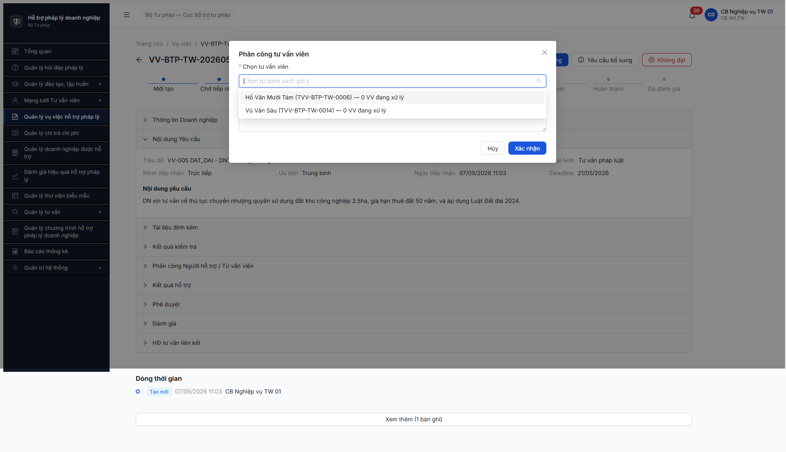
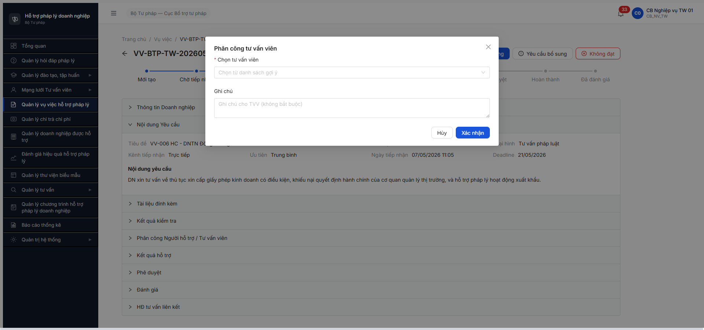

# Bug Report — Vụ việc HTPL (R7.4.A3 workflow)

| Thông tin | Giá trị |
|-----------|---------|
| **Dự án** | PM HTPLDN |
| **Môi trường** | http://103.172.236.130:3000/ |
| **Người test** | Claude Code (Opus 4.7) — QA Automation |
| **Ngày** | 2026-05-08 |
| **Loại test** | Workflow (FR-05 v3.5 refactor) |
| **Round** | R8 |
| **Tài liệu tham chiếu** | [`srs-update-2026-5-5/srs-fr-05-vu-viec.md`](../../../../input/srs-update-2026-5-5/srs-fr-05-vu-viec.md) · [`_DELTA-MAP-FR05.md`](../../../../input/srs-update-2026-5-5/_DELTA-MAP-FR05.md) · [`output/funtion/7.5-vu-viec-htpl.md`](../../../funtion/7.5-vu-viec-htpl.md) · [`output/smoke/6.5-sm-vuviec.md`](../../../smoke/6.5-sm-vuviec.md) |

---

## Tổng hợp

Phát hiện **5** lỗi có SRS reference cụ thể trong R8 R7.4.A3 workflow VV (trong đó 4 phát sinh trên đường advance VV-005 từ DA_TIEP_NHAN → DA_PHAN_CONG, 1 phát sinh trên VV-006 modal Phân công LV Hành chính). 5/5 đều block hoặc chặn migration v3 → v3.5. Workflow B4+ (DA_PHAN_CONG → DANG_XU_LY) BLOCKED bởi BUG-VV-AUTH-01 → 6/8 task downstream cascade block.

### Severity breakdown

| Tổng | Critical | Major | Medium | Minor | Trivial |
|------|----------|-------|--------|-------|---------|
| 5    | 2        | 2     | 0      | 1     | 0       |

## Bug Summary Table

| Bug ID | Severity | Priority | Type | TC Ref | **SRS Reference** | Title | Status |
|--------|----------|----------|------|--------|-------------------|-------|--------|
| BUG-VV-SCHEMA-01 | Critical | P0 | Data | C3-1 | `srs-fr-05-vu-viec.md:712-715` (FR-V.I-09 Inputs) + `_DELTA-MAP-FR05.md` Thay đổi 8 | Entity VU_VIEC chưa migrate v3.5 — `loaiDoiTuongXuLy/nguoiXuLyId/toChucTuVanId` không tồn tại trong response | Open |
| BUG-VV-AUTH-01 | Critical | P0 | Workflow | TP-VV-04, C3-3 | `srs-fr-05-vu-viec.md` BR-AUTH-01 (Tier 2 SSO VNeID cho TVV/CG/NHT) | TVV/CG/NHT không thể login Tier 1 — workflow B4 (DA_PHAN_CONG → DANG_XU_LY) bị block | Open |
| BUG-VV-PC-MODAL-01 | Major | P0 | UI/UX | C3-1, C3-3, C3-4 | `srs-fr-05-vu-viec.md:773-776` (Acceptance Criteria FR-V.I-09) + `_DELTA-MAP-FR05.md` Thay đổi 8 | Modal Phân công SCR-V.I-03 chỉ có 1 dropdown TVV — thiếu 2 thẻ Cá nhân/Tổ chức | Open |
| BUG-VV-SLA-01 | Major | P1 | Calculation | VV-006, C6-1 | `srs-fr-05-vu-viec.md:43, 334, 1501` (BR-SLA-01) + NĐ55/2019 Đ.8 K.1 | Deadline tính 10 ngày LV thay vì 15 ngày LV theo BR-SLA-01 v3.5 | Open |
| BUG-VV-PC-WRN-01 | Minor | P2 | UI/UX | C3-6 | `srs-fr-05-vu-viec.md:768` (Error Handling FR-V.I-09 E3 — WRN-PC-01) | Modal pool empty (LV không match) hiện image "Trống" — KHÔNG có WRN-PC-01 + override tìm thủ công | Open |

> **Chú thích Type:**
> - `Happy` — luồng chính thành công
> - `Negative` — input/thao tác sai
> - `Edge` — giá trị biên
> - `Workflow` — chuyển trạng thái
> - `Permission` — phân quyền
> - `Data` — toàn vẹn dữ liệu / schema migration
> - `UI/UX` — giao diện
> - `Calculation` — tính toán / business rule

---

## BUG-VV-SCHEMA-01 — Entity VU_VIEC chưa migrate sang v3.5 schema

### Mô tả

Entity VU_VIEC trong response API `GET /api/v1/vu-viecs/{id}` vẫn dùng schema v3 — 3 field mới của v3.5 (`loaiDoiTuongXuLy`, `nguoiXuLyId`, `toChucTuVanId` từ FR-V.I-09 Inputs) **không tồn tại** trong response. Field legacy v3 `nguoiHoTroId` vẫn còn (theo Delta Map đã bỏ trong v3.5). BE chưa apply Thay đổi 8 trong `_DELTA-MAP-FR05.md`. Toàn bộ TC Cluster 3 (8 TC) sẽ FAIL.

### Các bước tái hiện

1. Login `cb_nv_tw_01` (CB_NV_TW) qua MCP / curl auth flow.
2. GET `/api/v1/vu-viecs/6ac795ea-4c08-4189-8d37-797662060e49` (VV-005, đang DA_TIEP_NHAN).
3. Inspect `response.data` keys: `Object.keys(d.data)`.
4. Quan sát: `loaiDoiTuongXuLy`, `nguoiXuLyId`, `toChucTuVanId` đều `undefined`. `nguoiHoTroId` = `null` (legacy còn).
5. Sau khi POST `/phan-cong` body `{tuVanVienId: "e4aad026-..."}` thành công → re-GET → 3 field v3.5 vẫn không xuất hiện trong response.

### Kết quả mong đợi

Theo `srs-fr-05-vu-viec.md:712-715` FR-V.I-09 Inputs (sau Thay đổi 8):
- `loai_doi_tuong_xu_ly` text(enum) — CHECK IN ('CA_NHAN','TO_CHUC')
- `nguoi_xu_ly_id` identifier — FK → TAI_KHOAN (luôn có cho cả 2 loại)
- `to_chuc_tu_van_id` identifier — Y nếu loai='TO_CHUC'

Field `nguoi_ho_tro_id` (entity v3) đã bị bỏ.

### Kết quả thực tế

```javascript
// GET /api/v1/vu-viecs/6ac795ea-4c08-4189-8d37-797662060e49 keys
[
  'id', 'nguoiTaoId', 'nguoiCapNhatId', 'ngayTao', 'ngayCapNhat',
  'donViId', 'seqId', 'version', 'trangThai',
  'nguoiGuiDuyetId', 'ngayGuiDuyet', 'nguoiDuyetId', 'ngayDuyet',
  'ghiChuPheDuyet', 'maVuViec', 'tieuDe', 'moTa', 'doanhNghiepId',
  'linhVucId', 'loaiHinhHtId', 'kenhTiepNhan', 'maHoSoDvc',
  'heThongNguon', 'maHoSoNguon', 'nguoiTiepNhanId', 'ngayTiepNhan',
  'nguoiHoTroId',  // ← legacy v3, đã bỏ trong v3.5
  'ngayPhanCong', 'deadline', 'mucDoCanhBao',
  'ngayHoanThanh', 'ketQuaTomTat', 'diemDanhGia',
  'uuTien', 'lyDoUuTien', 'daYeuCauBoSung', 'boSungCount',
  'ngayYeuCauBoSung', 'vuViecVuongMac', 'ketQuaXuLy',
  // ❌ MISSING: loaiDoiTuongXuLy, nguoiXuLyId, toChucTuVanId
  'linhVuc', 'loaiHinh', 'doanhNghiep', 'nguoiTiepNhan', 'nguoiHoTro',
  '_links'
]
```

### Bằng chứng


```bash
# Inspect via curl + node
$ curl -s "/api/v1/vu-viecs/6ac795ea-..." -H "Authorization: Bearer $TOKEN" | node -e "
const d = JSON.parse(require('fs').readFileSync(0,'utf8'));
console.log('loaiDoiTuongXuLy:', d.data.loaiDoiTuongXuLy);  // undefined
console.log('nguoiXuLyId:', d.data.nguoiXuLyId);              // undefined
console.log('toChucTuVanId:', d.data.toChucTuVanId);          // undefined
console.log('nguoiHoTroId:', d.data.nguoiHoTroId);            // null (still exists)
"
```

---

## BUG-VV-AUTH-01 — TVV/CG/NHT account không thể login Tier 1; workflow B4 BLOCKED

### Mô tả

Pool có **2 TVV + 8 CG + 4 NHT + 2 DN account** trong `/api/v1/tai-khoan` (admin endpoint), nhưng KHÔNG account nào login được qua endpoint Tier 1 `/api/v1/auth/login` với password mặc định `Secret@123`. Theo BR-AUTH-01: TVV/CG/NHT/DN dùng SSO VNeID Tier 2 — môi trường test chưa có VNeID sandbox. Hệ quả: workflow B4 (`DA_PHAN_CONG → DANG_XU_LY` qua TVV chấp nhận phân công) **không thể test** → cascade block 5 transition tiếp theo + 6 task downstream (R7.4.A3-PUBLIC, R7.4.A3-DN-BS, R7.7.3, R7.7.3-PRIVACY, R7.3.14, R7.5.4).

### Các bước tái hiện

1. Login QTHT `qtht_01` → GET `/api/v1/tai-khoan?pageSize=50` → trả 39 records, identify `vu_sau_06` (TVV-BTP-TW-0014, Vũ Văn Sáu).
2. Phân công VV-005 cho TVV-0014 qua MCP UI hoặc POST `/api/v1/vu-viecs/{id}/phan-cong` — VV transition `DANG_KIEM_TRA → DA_PHAN_CONG` ✅.
3. Logout `cb_nv_tw_01`. POST `/api/v1/auth/login` body `{username:"vu_sau_06", password:"Secret@123"}`.
4. Quan sát: response `400 ERR-AUTH-LOGIN-01 "Tên đăng nhập hoặc mật khẩu không đúng"`.
5. Repeat với `nht_01`, `ho_18` (CG), `1234567893` (DN) — tất cả fail cùng error code.
6. KHÔNG có endpoint VNeID test/mock + sandbox VNeID không expose qua portal `103.172.236.130:8025` (MailHog).

### Kết quả mong đợi

Theo `srs-fr-05-vu-viec.md` BR-AUTH-01 + spec `7.5-vu-viec-htpl.md` line 25 Tài khoản test: TVV/CG/NHT/DN cần login được. Trong môi trường test, BA phải:
- (a) Cung cấp VNeID sandbox với TK test mapping đến vu_sau_06 / nht_01 / etc., HOẶC
- (b) Inject API workaround `/auth/login-test-as-tvv` để bypass VNeID trong env test, HOẶC
- (c) Cho phép password local cho role TVV/CG/NHT/DN trong env DEV/TEST.

### Kết quả thực tế

```bash
$ curl -X POST .../auth/login -d '{"username":"vu_sau_06","password":"Secret@123"}'
{"success":false,"error":{"code":"ERR-AUTH-LOGIN-01","message":"Tên đăng nhập hoặc mật khẩu không đúng."}}

$ curl -X POST .../auth/login -d '{"username":"nht_01","password":"Secret@123"}'
{"success":false,"error":{"code":"ERR-AUTH-LOGIN-01"}}

$ curl -X POST .../auth/login -d '{"username":"ho_18","password":"Secret@123"}'
{"success":false,"error":{"code":"ERR-AUTH-LOGIN-01"}}
```

### Bằng chứng



```bash
# Bằng chứng pool có TK nhưng login fail (admin GET /tai-khoan)
$ curl -s "/api/v1/tai-khoan?pageSize=50" -H "Authorization: Bearer $QTHT_TOKEN" | node -e "..."
# Output snippet:
#  - vu_sau_06 | Vũ Văn Sáu | TVV
#  - nguyen_tuvan_01 | Nguyễn Văn Tư Vấn | TVV
#  - ho_18 | Hồ Văn Mười Tám | CG
#  - mai_17 | Mai Thị Mười Bảy | CG
#  - truong_16 | Trương Văn Mười Sáu | CG (đã phân công VV-002)
#  - ngo_15 | Ngô Thị Mười Lăm | CG (đã phân công VV-001)
#  - nht_01..04 | NHT (4 record)
#  - 0111176707, 1234567893 | DN (2 record)
# Tất cả 16 account TVV/CG/NHT/DN — KHÔNG ai login local OK.
```

---

## BUG-VV-PC-MODAL-01 — Modal Phân công thiếu 2 thẻ Cá nhân/Tổ chức (FR-V.I-09 Thay đổi 8)

### Mô tả

Modal Phân công SCR-V.I-03 (FR-V.I-09 v3.5) **chỉ có 1 dropdown** "Chọn tư vấn viên" + textarea "Ghi chú". Theo Acceptance Criteria FR-V.I-09 line 773-776 + Thay đổi 8 trong `_DELTA-MAP-FR05.md`, modal PHẢI có 2 thẻ tab/segment:
- **Thẻ "Cá nhân"** — list TAI_KHOAN có vai trò TVV/CG hoặc NHT
- **Thẻ "Tổ chức"** — list TO_CHUC_TU_VAN; sau khi chọn TC → load TVV thuộc TC đó

UI hiện tại bypass 2 thẻ → KHÔNG cho phép phân công TO_CHUC → mất feature trọng tâm v3.5 (UC59 mở rộng từ "phân công cá nhân" sang "phân công cá nhân HOẶC tổ chức"). Validation ERR-PC-06 ("TVV không thuộc TC") + ERR-PC-07 ("CA_NHAN không cần TC") không thể test. C3-1 đến C3-8 FAIL/blocked.

### Các bước tái hiện

1. Login `cb_nv_tw_01` qua MCP. Vào module "Quản lý vụ việc HTPL" → list 5 VV.
2. Click VV-005 (state DA_TIEP_NHAN) → click [Kiểm tra hồ sơ] → modal 6 hạng mục → [Xác nhận] → state advance DANG_KIEM_TRA.
3. Click button [Phân công] (icon team) → modal "Phân công tư vấn viên" mở.
4. Quan sát modal layout: chỉ có 1 combobox "Chọn tư vấn viên" + 1 textarea "Ghi chú" + 2 button "Hủy"/"Xác nhận".
5. Confirm KHÔNG có tab/segment "Cá nhân"/"Tổ chức" + KHÔNG có select "Tổ chức tư vấn".

### Kết quả mong đợi

Theo `srs-fr-05-vu-viec.md:773-776`:
- **Given** CB NV chọn cá nhân (TVV/CG hoặc NHT) ở thẻ **"Cá nhân"** → SET `loai_doi_tuong_xu_ly='CA_NHAN'`, `nguoi_xu_ly_id`, `to_chuc_tu_van_id=NULL`.
- **Given** CB NV chọn Tổ chức tư vấn ở thẻ **"Tổ chức"** + dropdown TVV thuộc TC xuất hiện → SET `loai_doi_tuong_xu_ly='TO_CHUC'`, `to_chuc_tu_van_id`, `nguoi_xu_ly_id` (TVV được cử).
- **Given** TVV không thuộc TC được chọn → ERR-PC-06 chặn.

### Kết quả thực tế

Modal HTML structure (qua snapshot a11y tree):
```
dialog "Phân công tư vấn viên"
├── combobox required "* Chọn tư vấn viên" (placeholder "Chọn từ danh sách gợi ý")
├── textbox multiline "Ghi chú"
├── button "Hủy"
└── button "Xác nhận"
```
Combobox option list (sau click): `[ho_18 (CG-0006), vu_sau_06 (TVV-0014)]` cho VV-005 LV Đất đai. Tất cả option là cá nhân — KHÔNG có Tổ chức tư vấn nào.

### Bằng chứng


```text
Snapshot a11y tree (rút gọn):
uid=19_0 dialog "Phân công tư vấn viên" modal
  uid=19_1 button "Close" focusable
  uid=19_2 StaticText "Phân công tư vấn viên"
  uid=19_4 StaticText "Chọn tư vấn viên"
  uid=19_5 StaticText "Chọn từ danh sách gợi ý"
  uid=19_6 combobox "* Chọn tư vấn viên" required
  uid=19_8 StaticText "Ghi chú"
  uid=19_9 textbox "Ghi chú" multiline
  uid=19_10 button "Hủy"
  uid=19_11 button "Xác nhận"
```

---

## BUG-VV-SLA-01 — Deadline tính 10 ngày LV thay vì 15 ngày LV (BR-SLA-01 v3.5)

### Mô tả

Trên VV list + VV detail, deadline tính từ `ngay_tiep_nhan = 07/05/2026` đến `21/05/2026` = 14 ngày calendar = 10 ngày LV (trừ T7/CN 9-10/5 và 16-17/5). Theo BR-SLA-01 v3.5 (cập nhật 2026-05-06 từ 10 → 15 ngày), deadline chuẩn phải là `ngay_tiep_nhan + 15 ngày LV` theo NĐ 55/2019 Điều 8 Khoản 1. BE chưa migrate cấu hình SLA + chưa apply BR-SLA-01 v3.5 mới.

### Các bước tái hiện

1. Login `cb_nv_tw_01` → vào "Quản lý vụ việc HTPL".
2. Quan sát 5 VV trong list — tất cả `Ngày tiếp nhận = 07/05/2026`, `Deadline = 21/05/2026`, `Cảnh báo = "Còn 9 ngày LV"`.
3. Tính: 07/05 (Thứ 5, không tính) → 8/5 (T6, LV1) → 9/5 T7 → 10/5 CN → 11/5 (LV2) → 12/5 (LV3) → 13/5 (LV4) → 14/5 (LV5) → 15/5 (LV6) → 16/5 T7 → 17/5 CN → 18/5 (LV7) → 19/5 (LV8) → 20/5 (LV9) → 21/5 (LV10) ⇒ **10 ngày LV**.
4. Theo BR-SLA-01 v3.5: 15 LV phải đến `28/05/2026` (3 LV thêm sau 21/5).

### Kết quả mong đợi

Theo `srs-fr-05-vu-viec.md:43`: "**SLA:** 15 ngày làm việc (NĐ55/2019 Điều 8 Khoản 1 — trả lời vướng mắc pháp lý cho DNNVV) — BR-SLA-01"

Theo `srs-fr-05-vu-viec.md:334` Processing UC54 step 8: "Tính deadline SLA: ngày tiếp nhận + 15 ngày làm việc (NĐ55/2019 Điều 8 Khoản 1)"

Theo `srs-fr-05-vu-viec.md:1501` Acceptance UC108: "QTHT cấu hình SLA = 15 ngày LV (mặc định)"

Deadline đúng: 07/05/2026 + 15 ngày LV (trừ T7/CN + ngày lễ NGAY_LE) = 28/05/2026.

### Kết quả thực tế

5 VV list show:
| Mã VV | Ngày tiếp nhận | Deadline | Cảnh báo |
|---|---|---|---|
| VV-006 | 07/05/2026 | 21/05/2026 | Còn 9 ngày LV |
| VV-005 | 07/05/2026 | 21/05/2026 | Còn 9 ngày LV |
| VV-004 | 07/05/2026 | 21/05/2026 | Còn 9 ngày LV |
| VV-002 | 07/05/2026 | 21/05/2026 | Còn 9 ngày LV |
| VV-001 | 07/05/2026 | 21/05/2026 | Còn 9 ngày LV |

Deadline 21/05 = 10 LV. **Thiếu 5 LV** so với BR-SLA-01 v3.5.

### Bằng chứng


```text
GET /api/v1/vu-viecs/6ac795ea-... → response.data:
  ngayTiepNhan: "2026-05-07T04:03:45.638Z"
  deadline:     "2026-05-21T04:03:45.638Z"  // ❌ phải là 2026-05-28 (15 LV)
  mucDoCanhBao: "BINH_THUONG"
```

⚠️ Note BA: Cite BR-SLA-01 v3.5 chưa web-verify NĐ55/2019 Điều 8 Khoản 1 (per `_DELTA-MAP-FR05.md` ghi chú "cite chưa web-verify"). Nếu thực tế NĐ ghi 10 ngày LV → BR-SLA-01 v3.5 SAI; nếu 15 ngày LV → BE SAI. Cần BA confirm cite NĐ trước khi fix.

---

## BUG-VV-PC-WRN-01 — Modal pool empty không có WRN-PC-01 + override

### Mô tả

Khi pool TVV/CG/NHT cho VV-006 (LV Hành chính) trả empty (do 9 record HOAT_DONG không có ai LV Hành chính), modal hiển thị 2 lần image "Trống" trong dropdown nhưng KHÔNG hiện warning WRN-PC-01 "Không tìm thấy đối tượng phù hợp lĩnh vực" và KHÔNG có nút/option "Tìm thủ công" / "Override LV". CB NV bị stuck — không phân công được, không có path khắc phục.

### Các bước tái hiện

1. Login `cb_nv_tw_01`. Vào "Quản lý vụ việc HTPL".
2. Click VV-006 (LV Hành chính, state DA_TIEP_NHAN) → click [Kiểm tra hồ sơ] → [Xác nhận] → DANG_KIEM_TRA.
3. Click [Phân công] → modal "Phân công tư vấn viên" mở.
4. Click combobox "Chọn tư vấn viên" — listbox expand.
5. Quan sát: empty state "Trống" hiện 2 lần trong listbox; KHÔNG có text "Không tìm thấy đối tượng phù hợp lĩnh vực" hay nút "Tìm thủ công".

### Kết quả mong đợi

Theo `srs-fr-05-vu-viec.md:768` (Error Handling FR-V.I-09 E3):
| E3 | Không có đối tượng phù hợp | WRN-PC-01 | "Không tìm thấy đối tượng phù hợp lĩnh vực" | WARNING |

Theo line 778 Acceptance: **"Given** không có đối tượng phù hợp **When** hiển thị **Then** cảnh báo + cho phép tìm thủ công"

UI phải hiện cả warning text + path tìm thủ công.

### Kết quả thực tế

Modal listbox content (qua `evaluate_script`):
```javascript
{ count: 0, options: [], empty: "TrốngTrống" }
```

Empty state chỉ là 2 image "Trống" stack — không có text WRN-PC-01, không có nút action.

### Bằng chứng



```bash
# API call confirm pool empty cho LV Hành chính
$ curl -s "/api/v1/vu-viecs/ddb6ea07-.../goi-y-tvv?limit=20" -H "Authorization: Bearer $TOKEN"
{
  "success": true,
  "data": [],
  "meta": {
    "total": 0,
    "casePriorityScore": 2,
    "isHighPriority": false,
    "linhVucId": "bbbbbbbb-0000-4000-8000-000000000012"   // LV Hành chính
  }
}
# Pool 9 TVV/CG HOAT_DONG breakdown by linhVucText:
#   "Đất đai" × 2, "Lao động" × 2, "Doanh nghiệp" × 2,
#   "Sở hữu trí tuệ" × 1, "Thuế" × 1, (trống) × 1
# → KHÔNG có ai LV Hành chính → BE filter trả empty đúng (data gap pool, không phải bug filter)
# Bug ở UI: không show WRN-PC-01 + override khi pool empty.
```

---

## Phụ lục — Môi trường test

| Thành phần | Giá trị |
|------------|---------|
| URL ứng dụng | http://103.172.236.130:3000/ |
| OTP login | 666666 (bypass tạm) |
| MailHog (OTP inbox) | http://103.172.236.130:8025 |
| API base | http://103.172.236.130:3000/api/v1 |
| Frontend | React + Vite + Ant Design |
| Xác thực | JWT (Tier 1 nội bộ CB) + Tier 2 SSO VNeID (DN/TVV/CG/NHT — chưa có sandbox) |
| Tool test | Chrome DevTools MCP (UI smoke) + curl (API verify) |
| Account dùng | `cb_nv_tw_01` (CB_NV_TW + CB_PD_TW + QA_VT_DEL_TEST_R7) · `qtht_01` (admin tai-khoan list) |

---

*Bug report generated: 2026-05-08 | Claude Code (Opus 4.7) via QA Automation*
