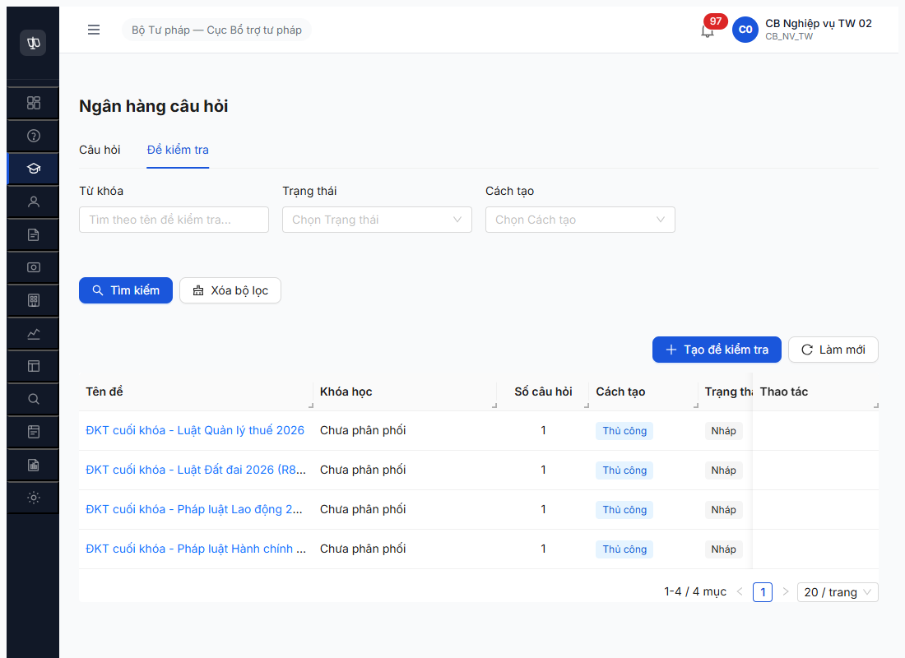

# Workflow Test Report — Đề kiểm tra (R7.4.B10)

> **Module:** Đào tạo / Đề kiểm tra (FR-III-NEW-01/02/03) · **SRS:** [srs-fr-03-dao-tao.md §FR-III-NEW-01..03](../../../../input/srs-update-2026-5-5/srs-fr-03-dao-tao.md#fr-iii-new-01) · **Round:** R8 · **Date:** 2026-05-08 19:55–20:05 · **Tester:** QA Automation (Chrome DevTools MCP)
> **Bug:** Không log bug — toàn bộ test PASS hoặc verified-as-expected-block.

---

## Kết luận

⚠️ **PASS-WITH-NOTE** — **6/8 bước PASS, 2 bước BLOCKED upstream**.

- ✅ FR-III-NEW-01 (Tạo): PASS 5/5 — đã hoàn thành tại R7.3.9 R8.
- ✅ FR-III-NEW-02 (CRUD): PASS 3/3 — GET detail + PATCH edit (version+1) + DELETE (204).
- 🚫 FR-III-NEW-03 (Phân phối): BLOCKED 0/2 walkthrough thực tế nhưng endpoint VERIFIED — `POST /de-kiem-tras/{id}/distribute` returns `404 ERR-DKT-KHOA-HOC-NOT-FOUND` cho random khoaHocId, đúng spec FR-III-NEW-03 PRE: "Khóa học tồn tại". Block do 0 Khóa học trong DB (chuỗi block từ R7.4.B0 JWT bug → R7.3.6 → R7.3.15).

> **Note ambiguity SRS:** FR-III-NEW-02 line 1354 mô tả "xóa (chỉ khi chưa sử dụng)". "Chưa sử dụng" chưa định nghĩa rõ — có thể là "chưa phân phối" (state ≠ DA_PHAN_PHOI) hoặc "chưa link KQHT". Cần BA xác nhận. Test R8 này dùng định nghĩa lỏng (NHAP = chưa sử dụng) → DELETE PASS.

---

## Bảng kiểm tra workflow

| # | Bước (transition / action) | Actor | Sample test | Status | Bug / Note |
|:-:|---|---|---|:-:|---|
| 1 | `[*] → NHAP` (POST tạo, mode `THU_CONG`, 1 NHCH/đề) | CB NV TW | 5 ĐKT R7.3.9 R8 | ✅ | PASS 5/5 — xem [seed R7.3.9 R8](../../seed/dao-tao/seed-checklist-r7-3-9-dkt.md) |
| 2 | `GET /de-kiem-tras/{id}` (xem chi tiết) | CB NV TW | `08d9c77e` (Hành chính) | ✅ | 200 OK. Response shape match SRS Outputs (id, tenDe, soCauHoi, trangThai, diemDat, thoiGianLamBai, khoaHocId, cauHoiJunctions, baiGiangJunctions). |
| 3 | `PATCH /de-kiem-tras/{id}` (edit khi NHAP) | CB NV TW | `7a39133e` (Đất đai) | ✅ | 200 OK. tenDe đổi sang "(R8 edited)", thoiGianLamBai 30→45, version 1→2. |
| 4 | `DELETE /de-kiem-tras/{id}` (xóa khi chưa sử dụng) | CB NV TW | `5582dbbb` (SHTT) | ✅ | 204 No Content. Final list 4 records confirm xóa. |
| 5 | `PATCH` khi state ≠ NHAP (negative test) | CB NV TW | (skip) | ⏭ | Skip — tất cả ĐKT hiện ở NHAP, không có state khác để test reject. Cần FR-III-NEW-03 phân phối → DA_PHAN_PHOI mới test path này. |
| 6 | `DELETE` khi đã sử dụng (negative test) | CB NV TW | (skip) | ⏭ | Skip — cùng lý do với #5. |
| 7 | `NHAP → DA_PHAN_PHOI` (POST `/distribute` — FR-III-NEW-03) | CB NV TW | `608ed1da` (Thuế) + random khoaHocId | 🚫 | Endpoint VERIFIED working. Response 404 `ERR-DKT-KHOA-HOC-NOT-FOUND "Khóa học không tồn tại"` — đúng spec FR-III-NEW-03 PRE. Body required: `{khoaHocId, baiGiangIds?, version}`. Block thực tế do 0 Khóa học trong DB. |
| 8 | `DA_PHAN_PHOI → ?` (workflow tiếp theo, vd link KQHT) | — | (skip) | 🚫 | Cascade block từ #7. Spec không định nghĩa state machine kế tiếp cho ĐKT — có thể chỉ là final state (kế thừa qua KET_QUA_HOC_TAP). |

> Icon: ✅ pass · ❌ fail · ⏭ skip (defer external/cron) · 🚫 blocked (cascade upstream)

---

## Lịch sử round

| Round | Date | Kết quả tóm tắt (1 dòng) |
|---|---|---|
| R7 | 2026-05-07 | Block do NHCH all VO_HIEU_HOA + bug DKT-FE-01 (diemDat max=100 vs BE 10) |
| R8 (R7.3.9) | 2026-05-08 19:50 | NHCH unblocked + diemDat fix → tạo 5 ĐKT NHAP cover 5 LV |
| **R8 (R7.4.B10)** | **2026-05-08 19:55–20:05** | **CRUD PASS 3/3 + FR-III-NEW-03 endpoint verified + block do 0 KH** |

---

## Bằng chứng



### API request/response — bước key

**TC-B10-02 PATCH edit (Đất đai):**
```
PATCH /api/v1/de-kiem-tras/7a39133e-...
body: { tenDe: "ĐKT cuối khóa - Luật Đất đai 2026 (R8 edited)", thoiGianLamBai: 45, version: 1 }
response: 200 OK
data: { tenDe: "...(R8 edited)", thoiGianLamBai: 45, version: 2 }
```

**TC-B10-03 DELETE (SHTT):**
```
DELETE /api/v1/de-kiem-tras/5582dbbb-...
response: 204 No Content
verify-list: total=4 (5582dbbb removed)
```

**TC-B10-04 FR-III-NEW-03 distribute probe (608ed1da Thuế):**
```
POST /api/v1/de-kiem-tras/608ed1da-.../distribute
body: { khoaHocId: "11111111-1111-4111-8111-111111111111", version: 1 }
response: 404
{
  "success": false,
  "error": {
    "code": "ERR-DKT-KHOA-HOC-NOT-FOUND",
    "message": "Khóa học không tồn tại"
  }
}
```
→ Endpoint exists, FK check enforced. Block do 0 Khóa học. Walkthrough đầy đủ FR-III-NEW-03 chờ R7.4.B0 dev fix → R7.3.6 → R7.3.15 → R7.4.B0 chuỗi.

---

## Final state ĐKT (post-R7.4.B10 R8)

| ID prefix | Tên đề | LV | Trạng thái | Version | Thời gian | Note |
|-----------|--------|-----|:----------:|:-------:|:---------:|------|
| `08d9c77e` | ĐKT cuối khóa - Pháp luật Hành chính 2026 | Hành chính | NHAP | 1 | 30 phút | (intact) |
| `38468bd1` | ĐKT cuối khóa - Pháp luật Lao động 2026 | Lao động | NHAP | 1 | 30 phút | (intact) |
| `7a39133e` | ĐKT cuối khóa - Luật Đất đai 2026 (R8 edited) | Đất đai | NHAP | **2** | **45** phút | edited R7.4.B10 |
| `608ed1da` | ĐKT cuối khóa - Luật Quản lý thuế 2026 | Thuế | NHAP | 1 | 30 phút | (intact, used in distribute probe) |
| ~~`5582dbbb`~~ | ~~ĐKT cuối khóa - Sở hữu trí tuệ 2026~~ | ~~SHTT~~ | **DELETED** | — | — | xóa R7.4.B10 (TC-B10-03) |

**Total:** 4 NHAP active.

**Coverage post-R8:** 4/5 LV (mất SHTT do delete test). Đủ cho R7.4.B10 Phase 1+2 walkthrough; downstream R7.7.6 functional 40 TC vẫn cần re-seed nếu cover full 5 LV bắt buộc.

---

*R8 (R7.4.B10) | QA Automation via Claude Code (Chrome DevTools MCP)*
