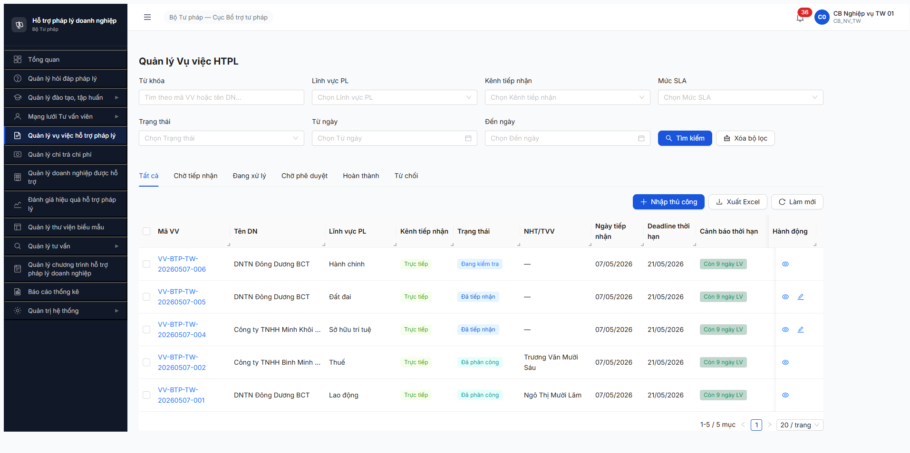
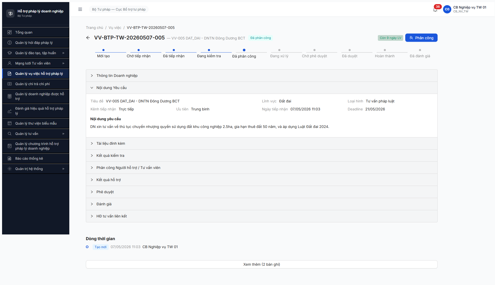

# Workflow Test Report — Vụ việc HTPL (R7.4.A3)

> **Module:** Vụ việc HTPL (FR-05 v3.5) · **SRS:** [`srs-update-2026-5-5/srs-fr-05-vu-viec.md`](../../../../input/srs-update-2026-5-5/srs-fr-05-vu-viec.md) · **Round:** R8 · **Date:** 2026-05-08 · **Tester:** Claude Code (Opus 4.7)
> **Bug:** [`../../bug-reports/vu-viec/bug-report-flow-vu-viec.md`](../../bug-reports/vu-viec/bug-report-flow-vu-viec.md)
> **Spec:** [`output/funtion/7.5-vu-viec-htpl.md`](../../../funtion/7.5-vu-viec-htpl.md) · [`output/smoke/6.5-sm-vuviec.md`](../../../smoke/6.5-sm-vuviec.md)

---

## Kết luận

⚠️ **PARTIAL — 3/8 bước PASS · 5 bước BLOCKED**. Workflow advance được B1→B2→B3 (DA_TIEP_NHAN → DANG_KIEM_TRA → DA_PHAN_CONG) qua VV-005 (LV Đất đai). **Block từ B4 trở đi** do BUG-VV-AUTH-01 (TVV/CG/NHT không thể login Tier 1 — yêu cầu VNeID Tier 2 sandbox).

**Status R7.4.A3:** 🚫 **BLOCKED** — không sinh đủ data downstream cho R7.4.A3-PUBLIC (cần VV DA_DUYET/HOAN_THANH) và R7.7.3-PRIVACY (cần cong_khai=1). R7.4.A3-DN-BS độc lập (cần VV YEU_CAU_BO_SUNG — chưa test).

**Cảnh báo migration v3 → v3.5:** BUG-VV-SCHEMA-01 cho thấy backend chưa migrate. Nếu fix BE schema xong vẫn thiếu VNeID sandbox → 3 task downstream tiếp tục block.

---

## Bảng kiểm tra workflow

> Reference: SM-VUVIEC từ [`6.5-sm-vuviec.md`](../../../smoke/6.5-sm-vuviec.md) — 13 test paths.

| # | Bước (transition) | Actor | Sample test | Status | Bug / Note |
|:-:|---|---|---|:-:|---|
| 1 | `DA_TIEP_NHAN → DANG_KIEM_TRA` ([Kiểm tra hồ sơ] checklist 6 hạng mục NĐ55, ketLuan=DAT) | CB_NV_TW | VV-006 (Hành chính) + VV-005 (Đất đai) | ✅ | POST `/api/v1/vu-viecs/{id}/kiem-tra` 201 OK |
| 2 | `DANG_KIEM_TRA → DA_PHAN_CONG` (Modal Phân công, chọn TVV gợi ý) | CB_NV_TW | VV-005 → TVV-0014 (Vũ Văn Sáu) | ⚠️ | PASS workflow + 4 bug spec v3.5 (BUG-VV-PC-MODAL-01 + BUG-VV-PC-WRN-01 + BUG-VV-SCHEMA-01 + BUG-VV-PC-NHT-API-404) |
| 3 | `DA_PHAN_CONG → DANG_XU_LY` (TVV/CG chấp nhận phân công) | TVV-0014 | vu_sau_06 | 🚫 | BLOCKED — BUG-VV-AUTH-01 (TVV password local fail; cần VNeID Tier 2 sandbox) |
| 4 | `DANG_XU_LY → CHO_PHE_DUYET` (cập nhật KQ + Trình PD) | TVV-0014 + CB_NV_TW | — | 🚫 | Cascade từ B3 |
| 5 | `CHO_PHE_DUYET → DA_DUYET` ([Phê duyệt]) | CB_PD_TW | — | 🚫 | Cascade từ B3 |
| 6 | `DA_DUYET → HOAN_THANH` ([Hoàn thành]) | CB_NV_TW / CB_PD | — | 🚫 | Cascade từ B3 |
| 7 | `HOAN_THANH → DA_DANH_GIA` (UC67 chấm điểm thang 0-10) | CB_NV / DN | — | 🚫 | Cascade từ B3 |
| 8 | `DANG_KIEM_TRA → TU_CHOI` (TP-VV-03, BR-FLOW-04 reason ≥10 char) | CB_NV_TW | — | ⏭ | Skip — không có VV thừa để test path TU_CHOI sau khi 5 VV pool đã advance hoặc kẹt B3 |

> Icon: ✅ pass · ❌ fail · ⏭ skip (defer external/cron) · 🚫 blocked (cascade upstream) · ⚠️ pass with bugs · — chưa test

### Test path coverage (theo SM-VUVIEC 13 path)

| TP ID | Mô tả | Status | Note |
|:-:|---|:-:|---|
| TP-VV-01 | Happy path full flow (8 state advance) | ⚠️ | 3/8 PASS, B4 BLOCKED |
| TP-VV-02 | DN bổ sung HS (FR-V.I-NEW-02) | ⏭ | Defer task R7.4.A3-DN-BS |
| TP-VV-03 | CB NV reject HS → TU_CHOI | ⏭ | Skip — pool VV pre-advance |
| TP-VV-04 | Phân công lại (cá nhân từ chối) | 🚫 | Block do B3 — không có TVV chấp nhận/từ chối |
| TP-VV-05 | SLA 15 ngày LV (BR-SLA-01) | ❌ | FAIL — verify deadline 14 calendar = 10 LV thay vì 15 LV (BUG-VV-SLA-01) |
| TP-VV-06 | Auto-transition trình PD | 🚫 | Cascade B3 |
| TP-VV-07 | Phân công TO_CHUC + ERR-PC-06 | 🚫 | Modal thiếu thẻ Tổ chức (BUG-VV-PC-MODAL-01) |
| TP-VV-08 | BR-CALC-04 ưu tiên NĐ55 | — | Chưa test (cần đa DN với gioi_tinh_chu_dn khác nhau) |
| TP-VV-09 | Immutability sau DA_DUYET | 🚫 | Cascade B3 |
| TP-VV-10 | Công khai VV (FR-V.I-NEW-05) | ⏭ | Defer task R7.4.A3-PUBLIC |
| TP-VV-11 | Hủy công khai (FR-V.I-NEW-05) | ⏭ | Defer task R7.4.A3-PUBLIC |
| TP-VV-12 | CB PD từ chối → DANG_XU_LY (Thay đổi 11) | 🚫 | Cascade B3 |
| TP-VV-13 | UC67 đánh giá 0-10 | 🚫 | Cascade B3 |

---

## Lịch sử round

| Round | Date | Kết quả tóm tắt |
|---|---|---|
| R8 (now) | 08/05 | 3/8 PASS (B1+B2+B3) · BLOCKED B4 do BUG-VV-AUTH-01 + 4 bug spec v3.5 phát hiện modal phân công |

---

## Bằng chứng

### B1+B2 PASS — VV-006 + VV-005 advance đến DANG_KIEM_TRA / DA_PHAN_CONG



> Snapshot list trước test (chỉ 5 VV scope BTP-TW): 3 DA_TIEP_NHAN + 2 DA_PHAN_CONG (VV-002 truong_16 + VV-001 ngo_15 từ R7.3.2 seed). Sau B1+B2: VV-006 → DANG_KIEM_TRA, VV-005 → DA_PHAN_CONG. **Lưu ý cột Deadline 21/05/2026 từ tiếp nhận 07/05/2026 = 10 ngày LV — không khớp BR-SLA-01 v3.5 (15 LV).**

### B3 BUG — Modal phân công chỉ 1 dropdown, KHÔNG có 2 thẻ Cá nhân/Tổ chức (FR-V.I-09 acceptance)


### B3 BUG kèm — Modal pool empty (LV Hành chính) KHÔNG có WRN-PC-01 + override


### B3 PASS — VV-005 sau phân công TVV-0014 (Vũ Văn Sáu)



### B3 BLOCKED — TVV vu_sau_06 không login local được (Tier 2 SSO required)

```bash
# POST /api/v1/auth/login
$ curl -X POST .../auth/login -d '{"username":"vu_sau_06","password":"Secret@123"}'
{"success":false,"error":{"code":"ERR-AUTH-LOGIN-01","message":"Tên đăng nhập hoặc mật khẩu không đúng."}}

# Pool TVV/CG/NHT account TỒN TẠI trong /api/v1/tai-khoan (admin endpoint)
# - vu_sau_06 (TVV-BTP-TW-0014, Vũ Văn Sáu)
# - nguyen_tuvan_01 (TVV)
# - 8 CG account (ho_18, mai_17, truong_16, ngo_15, dinh_14, ly_13, probe_optlock, probe_perm)
# - 4 NHT account (nht_01, nht_02, nht_03, nht_04_ui)
# - 2 DN account (0111176707, 1234567893)
# Nhưng KHÔNG account nào login bằng password local Secret@123 — match BR-AUTH-01: TVV/CG/NHT/DN dùng Tier 2 SSO VNeID
```

### B2 schema discovery — entity v3.5 fields chưa tồn tại (BUG-VV-SCHEMA-01)

```javascript
// GET /api/v1/vu-viecs/{vv-005-id} response.data keys:
// ❌ MISSING v3.5: loaiDoiTuongXuLy, nguoiXuLyId, toChucTuVanId
// ✅ STILL HAS v3 legacy: nguoiHoTroId (= null cho VV-005)
{
  "loaiDoiTuongXuLy": undefined,  // FR-V.I-09 line 713 v3.5
  "nguoiXuLyId":      undefined,  // FR-V.I-09 line 714 v3.5
  "toChucTuVanId":    undefined,  // FR-V.I-09 line 715 v3.5
  "nguoiHoTroId":     null        // legacy v3 — đã bỏ trong v3.5 nhưng vẫn còn trong response
}
```

---

## Module bị block (cascade)

- **R7.4.A3-PUBLIC** (Công khai VV lên Cổng PLQG): block do cần ≥1 VV ở state DA_DUYET hoặc HOAN_THANH — cascade B3.
- **R7.4.A3-DN-BS** (DN bổ sung HS qua VNeID): block do cần ≥1 VV ở state YEU_CAU_BO_SUNG (cũng cần CB NV click [Yêu cầu bổ sung] tại DANG_KIEM_TRA — có thể test riêng KHÔNG cascade B3, nhưng cần VNeID Tier 2 sandbox cho DN).
- **R7.7.3** (functional 72 TC): block do cần ≥1 VV mỗi state. Hiện chỉ **3/12 state có data ✅** (DA_TIEP_NHAN, DANG_KIEM_TRA, DA_PHAN_CONG); **6 state critical thiếu** (YEU_CAU_BO_SUNG, DANG_XU_LY, CHO_PHE_DUYET, DA_DUYET, HOAN_THANH, DA_DANH_GIA); 3 state out-of-scope (MOI_TAO + CHO_TIEP_NHAN kênh DVC inbound chưa test được, TU_CHOI optional path).
- **R7.7.3-PRIVACY** (2 TC P0 Critical): cascade R7.4.A3-PUBLIC.
- **R7.3.14** (Seed HĐ tư vấn DANG_THUC_HIEN): cần ≥1 VV HOAN_THANH — cascade.
- **R7.5.4** (BC04 export): cần VV HOAN_THANH — cascade.

---

## Ghi chú downstream readiness

| State | VV ID hiện tại | Có cho test? |
|---|---|---|
| MOI_TAO | — (kênh DVC inbound chưa test được) | ❌ |
| CHO_TIEP_NHAN | — | ❌ |
| DA_TIEP_NHAN | VV-004 | ✅ |
| DANG_KIEM_TRA | VV-006 | ✅ (sau B1 R8) |
| YEU_CAU_BO_SUNG | — (chưa test [Yêu cầu bổ sung]) | ❌ |
| DA_PHAN_CONG | VV-001, VV-002, VV-005 | ✅ (3 VV) |
| DANG_XU_LY | — | 🚫 BLOCKED B3 |
| CHO_PHE_DUYET | — | 🚫 BLOCKED |
| DA_DUYET | — | 🚫 BLOCKED |
| HOAN_THANH | — | 🚫 BLOCKED |
| DA_DANH_GIA | — | 🚫 BLOCKED |
| TU_CHOI | — | ⏭ Skip |

---

## Phụ lục — Quan sát chưa đủ điều kiện log bug

> Per memory `feedback_bug_must_have_srs_ref`: chỉ log file bug khi map được clause SRS cụ thể + có screenshot. Các quan sát dưới đây cite SRS được nhưng evidence chưa đủ để log Bug entry.

1. **Endpoint admin `/api/v1/nguoi-ho-tros` 404** — entity NGUOI_HO_TRO theo FR-V.I-09 line 722 + Entity table phải có endpoint admin. List `/api/v1/tai-khoan` show 4 NHT account (nht_01..04) nhưng không có endpoint riêng để CRUD NHT entity. Có thể alias name khác (chưa probe đủ). → Note dev/BA xác nhận tên endpoint chính thức.
2. **Pool 9 TVV/CG HOAT_DONG: 1 LV "Đất đai" + 1 trống + 0 LV "Hành chính"** — data seeding thiếu cover full LV theo `entity-map.md`. Khi VV-006 LV Hành chính cần phân công, pool empty → blocking gợi ý. R7.2.3 ✅ đã pass nhưng có thể không đảm bảo cover full LV — cần re-verify seed task.
3. **Cột header table list: "NHT/TVV"** — nhãn cột v3 chưa update sang "Người xử lý / Tổ chức" theo SCR-V.I-01 row 17 (line 1678 srs-fr-05-vu-viec.md). Đây có thể là pending UI task trong v3.5 refactor.

---

*R8 | 2026-05-08 | Workflow advance B1+B2+B3 PASS, B4 BLOCKED chờ VNeID sandbox + dev fix BUG-VV-SCHEMA-01.*
