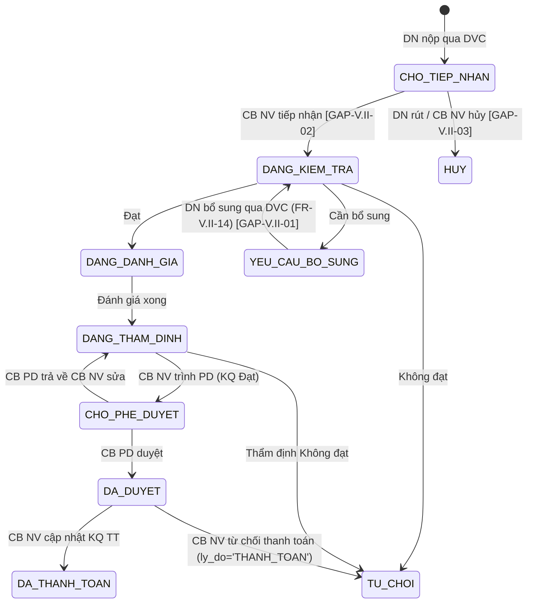

# 6.6 SM-CHITRA (Chi trả Chi phí) — 10 trạng thái (v3.5)

> **Nguồn:** Tách từ [test-strategy.md §6.4](../test-strategy.md#6-test-theo-state-machine)
> **Module liên quan:** [funtion/7.6-chi-tra-chi-phi.md](../funtion/7.6-chi-tra-chi-phi.md)
> **SRS reference:** [`input/srs-update-2026-5-5/srs-fr-06-chi-tra.md`](../../input/srs-update-2026-5-5/srs-fr-06-chi-tra.md) §5 SM-CHITRA
> **Số test paths:** 11 | **Số trạng thái:** 10 | **Số transition:** 14
> **Last updated:** 2026-05-06 — apply v3.5

---

## Danh sách trạng thái

| Mã | Nhãn hiển thị (Việt) | Ý nghĩa | Màu |
|-------|------|---------|-----|
| CHO_TIEP_NHAN | Chờ tiếp nhận | DN nộp qua DVC, chờ CB NV tiếp nhận | Xanh dương |
| DANG_KIEM_TRA | Đang kiểm tra | CB NV đang kiểm tra thành phần hồ sơ | Vàng |
| YEU_CAU_BO_SUNG | Yêu cầu bổ sung | Hồ sơ thiếu, chờ DN bổ sung (max 3 lần) | Cam |
| DANG_DANH_GIA | Đang đánh giá | Hồ sơ đạt, CB NV đang đánh giá mức hỗ trợ | Xanh dương đậm |
| DANG_THAM_DINH | Đang thẩm định | CB NV đang thẩm định chi phí | Vàng đậm |
| CHO_PHE_DUYET | Chờ phê duyệt | CB NV trình, chờ CB PD phê duyệt | Cam đậm |
| DA_DUYET | Đã duyệt | CB PD đã phê duyệt, chờ thanh toán | Xanh lá đậm |
| DA_THANH_TOAN | Đã thanh toán | CB NV cập nhật kết quả thanh toán | Xanh lá |
| TU_CHOI | Từ chối | Hồ sơ không đạt điều kiện (kiểm tra / thẩm định / thanh toán) | Đỏ |
| HUY | Hủy | Hồ sơ bị hủy (DN rút hoặc CB NV hủy) | Đỏ đậm |

> **❗ v3.5 BỎ enum cũ:** `MOI` / `DA_TIEP_NHAN` / `CHO_THAM_DINH` / `DA_THAM_DINH` / `TU_CHOI_THAM_DINH` / `TU_CHOI_THANH_TOAN` (không nằm trong CHECK constraint).

## Test Paths

```
Test Paths v3.5:
├── TP-CT-01: Happy Path
│   CHO_TIEP_NHAN → DANG_KIEM_TRA → DANG_DANH_GIA → DANG_THAM_DINH
│   → CHO_PHE_DUYET → DA_DUYET → DA_THANH_TOAN
│
├── TP-CT-02: Yêu cầu bổ sung (max 3 lần — bo_sung_count CHECK 0-3)
│   DANG_KIEM_TRA → YEU_CAU_BO_SUNG → DANG_KIEM_TRA (≤ 3 lần)
│   ⚠️ Lần 4 — hành vi BE/UI ⏳ chờ BA confirm Q1 (auto TU_CHOI ĐÃ BỎ — Thay đổi 5 OUT)
│
├── TP-CT-03: Từ chối khi kiểm tra
│   DANG_KIEM_TRA → TU_CHOI (Không đạt; ghi ly_do_tu_choi)
│
├── TP-CT-04: Tính mức hỗ trợ (BR-CALC-01/02)
│   Siêu nhỏ: 100% (trần 3M/năm)
│   Nhỏ: tối đa 30% (trần 5M/năm)
│   Vừa: tối đa 10% (trần 10M/năm)
│   so_tien_duyet = MIN(so_tien_de_nghi, phi_tu_van × muc_ho_tro%, tran_nam − da_chi_trong_nam)
│
├── TP-CT-05: CB PD từ chối — TRẢ VỀ thẩm định (KHÔNG phải Từ chối cuối)
│   CHO_PHE_DUYET → DANG_THAM_DINH (lý do ≥ 10 ký tự)
│   → tạo PHE_DUYET_CHI_TRA quyet_dinh=TU_CHOI
│   → TB CB NV (KHÔNG TB TVV/DN)
│   CB NV điều chỉnh thẩm định xong có thể Trình PD lại — N:1 cho phép nhiều bản ghi
│
├── TP-CT-06: Payment Zero Guard (BR-EC-22)
│   phi_tu_van > 0 và so_tien_de_nghi > 0
│   so_tien_thuc_tra ≤ so_tien_duyet
│
├── TP-CT-07: Annual Ceiling Reset (BR-EC-14 implicit)
│   da_chi_trong_nam reset về 0 ngày 1/1 hàng năm
│
├── TP-CT-08: Over-cap edge case
│   DN đã chi gần trần → yêu cầu mới → verify tính đúng số dư
│
├── TP-CT-09: Từ chối khi thẩm định
│   DANG_THAM_DINH → TU_CHOI (Không đạt; ly_do_tu_choi prefix "THAM_DINH:")
│
├── TP-CT-10: DN rút hồ sơ [GAP-V.II-03]
│   CHO_TIEP_NHAN → HUY (DN rút khi chưa qua DANG_DANH_GIA)
│   → ghi ly_do_huy = 'DN_RUT_HO_SO'
│   → TB CB NV nếu đã gán
│
├── TP-CT-11: DN bổ sung qua DVC [GAP-V.II-01] (FR-V.II-14)
│   YEU_CAU_BO_SUNG → DANG_KIEM_TRA
│   Guard: file hợp lệ (PDF/DOC/DOCX/JPG/PNG ≤10MB) AND chưa quá 5 ngày LV
│   → 3 kênh test: DN qua DVC | DN qua Cổng PLQG | CB NV thủ công thay DN
│
└── TP-CT-12: Từ chối thanh toán
    DA_DUYET → TU_CHOI (CB NV ghi ly_do_tu_choi prefix "THANH_TOAN:")
```

## Mermaid (đồng bộ SRS v3.5 §5)



## Mapping Test Path → Test Case

| Test Path | TC liên quan ở [§7.6](../funtion/7.6-chi-tra-chi-phi.md) |
|-----------|---------|
| TP-CT-01 | CT-003, CT-004, CT-007, CT-011, CT-012, CT-013, CT-015 |
| TP-CT-02 | CT-005, CT-006 (⏳ chờ BA Q1) |
| TP-CT-03 | CT-014 (Không đạt khi kiểm tra) |
| TP-CT-04 | CT-007, CT-008, CT-009, CT-010 |
| TP-CT-05 | CT-014 (CB PD trả về DANG_THAM_DINH) |
| TP-CT-06 | CT-016, CT-017 |
| TP-CT-07 | CT-019 |
| TP-CT-08 | CT-018 |
| TP-CT-09 | CT-014 (Không đạt khi thẩm định) |
| **TP-CT-10** | **CT-029, CT-032 (DN rút)** |
| **TP-CT-11** | **CT-033 (FR-V.II-14)** |
| TP-CT-12 | CT-031 (DA_DUYET → TU_CHOI khi từ chối thanh toán) |

## Business Rules áp dụng

- **BR-CALC-01:** Mức hỗ trợ theo quy mô DN — siêu nhỏ 100% (trần 3M), nhỏ 30% (trần 5M), vừa 10% (trần 10M)
- **BR-CALC-02:** Công thức `so_tien_duyet = MIN(so_tien_de_nghi, phi_tu_van × muc_ho_tro%, tran_nam − da_chi_trong_nam)`
- **BR-CALC-03:** Deadline = `ngay_tiep_nhan + N ngày làm việc` (N từ CAU_HINH_SLA)
- **BR-AUTH-05:** CB PD cùng cấp đơn vị — TP-CT-05
- **BR-EC-22:** `so_tien_thuc_tra ≤ so_tien_duyet` và `phi_tu_van > 0`, `so_tien_de_nghi > 0` — TP-CT-06
- **BR-FLOW-03:** Immutability sau DA_DUYET
- **BR-FLOW-04:** Lý do từ chối ≥ 10 ký tự (chỉ áp FR-V.II-12 — TP-CT-05)

> **❌ BỎ trong v3.5:**
> - **BR-EC-15** (Bổ sung lần 4 → auto TU_CHOI): OUT. TP-CT-02 hành vi lần 4 chờ BA Q1.
> - **BR-EC-16** (Auto TU_CHOI khi quá hạn): OUT — HS treo nếu DN không gửi trong 5 ngày LV.
> - **BR-SLA-02** (SLA dynamic): OUT — giữ V3 "4 mức cảnh báo C07".

## Data Readiness

| State | Mục đích test |
|-------|---------|
| CHO_TIEP_NHAN | TP-CT-01, TP-CT-10 |
| DANG_KIEM_TRA | TP-CT-02, TP-CT-03, TP-CT-11 |
| YEU_CAU_BO_SUNG (n=1, 2, 3) | TP-CT-02, TP-CT-11 |
| DANG_DANH_GIA | TP-CT-01, TP-CT-04 |
| DANG_THAM_DINH | TP-CT-01, TP-CT-05, TP-CT-09 |
| CHO_PHE_DUYET | TP-CT-01, TP-CT-05 |
| DA_DUYET | TP-CT-01, TP-CT-12 |

**Test data calculation (TP-CT-04):** Cần DN 3 quy mô khác nhau với các mức `phi_tu_van` để verify công thức MIN.

## Ghi chú thực thi

- **TP-CT-04 là path quan trọng nhất** — cần test matrix đầy đủ với ≥4 case/quy mô (under cap, at cap, over cap, annual ceiling hit).
- **TP-CT-05 (CB PD trả về):** Verify entity `PHE_DUYET_CHI_TRA` ghi N:1 — nếu CB PD trả về 2 lần thì có 2 bản ghi với `quyet_dinh=TU_CHOI`. Khi cuối cùng CB PD duyệt → bản ghi thứ 3 với `quyet_dinh=DUYET`.
- **TP-CT-07 (annual reset):** Nếu không control được thời gian hệ thống, đánh dấu P2 và verify bằng cách check logic trong code/SQL.
- **TP-CT-08 (over-cap):** Tạo DN siêu nhỏ đã chi 2.5M → yêu cầu thêm 1M → verify `so_tien_duyet = MIN(1M, 1M×100%, 3M − 2.5M) = 0.5M`.
- **TP-CT-10 (DN rút):** Verify chỉ rút được khi `trang_thai = CHO_TIEP_NHAN` (chưa qua DANG_DANH_GIA). Nếu ở DANG_KIEM_TRA hoặc xa hơn → ERR-CT-RUT-01.
- **TP-CT-11 (FR-V.II-14):** 3 kênh — kênh DN qua DVC + Cổng PLQG là external integration → BLOCKED. Chỉ test được kênh CB NV thủ công thay DN tại SCR-V.II-02.
